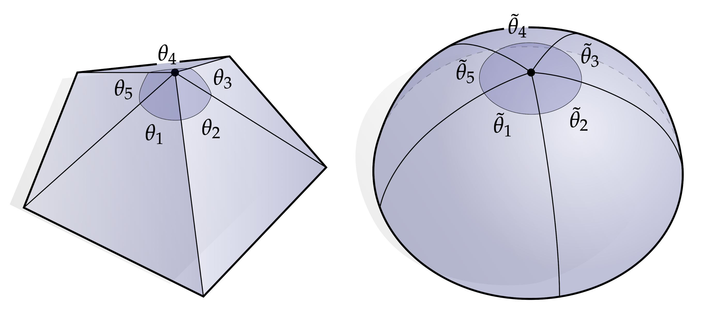

# 引言

这本书专注于三维中的几何处理，也为传统微分几何提供第一门课程。我们的目的在于通过计算的角度和数学的角度，来为大家展示一些基本的几何概念(例如曲率)。这种双重视角能相互丰富两个不同学科对这个问题的理解，并提供为现实世界中几何数据的处理提供切实可行的计算方法。在此过程中，我们将重新审视微积分和线性代数中的重要思想，重点强调直观的视觉理解，以补充更传统的数学课堂上的知识内容。本教程包含基本的数学背景知识以及大量的实际案例和应用。除此之外，还简要介绍了数字几何处理于离散微分几何的最新进展。**话题包括**：曲线曲面、曲率、联络、外代数、外微积分、斯托克斯理论、单纯同调、de Rham上同调、Helmholtz-Hodge分解定理、共形映射、有限元方法和数值线性代数。**应用包括**：曲率的近似、曲线和曲面的平滑、曲面参数化、向量场设计以及测地距离的计算。

这本书的一个主要目的是为处理真实世界的几何问题提供入门教程，它这套方法主要是用外微积分语言。外微积分是一个简单灵活而且十分有效的框架，它为几何处理提供了同一平台。这本书提供了基本的数学知识和大量的时间里，强调应用和实现。尽管大量核心概念在需要的时候还得反复查阅，但任何接触过线性代数和向量微积分的人应该都可以找到相关资源。习题主要基于C++，但不需要使用太深的编程知识，类似于继承、模版这些。这本书也提供指导性的书面练习，主要是为了加深对相关资源上的概念的理解。

有很多其他可以选择的方式来描述网格处理算法，为什么我们使用外微分？原因在于：外微积分和微分形式在很大程度上是微分几何和数学物理的现代语言。通过学习这门语言，我们可以利用大量现有知识来开发新算法，并根据成熟的理论更好地理解当前算法。它还允许我们在一个统一的框架中轻松实现许多看似不同的算法。例如，在这些笔记中，我们将看到如何仅通过几行代码来表达大量基本几何处理任务(平滑、参数化、向量场设计等)，通常是通过求解一个简单的泊松方程。

采取这种方法还有另一个不同于“以不同的方式说同样的事情”的很好的理由。我们通常先在光滑曲面上设计算法，然后确保这些基本的结构能在离散后的曲面上使用。作为一个基本的例子，考虑上面那张图的顶点。如果我们把顶角$\theta_i$全部加起来，我们通常会得到一个不同于$2 \pi$的数。对于光滑曲面，这个数正好是$2\pi$——用微分几何的语言说：切平面在任何点都应该包含一整个圈所有的方向。如果我们不断细分三角剖分，使得它越来越接近光滑曲面，这个顶点最终会变平，也就是说我们的角度确实会如预期那样接近$2\pi$。即便如此，我们能在很粗糙的网格上给出一个比较好的代替方案：我们重新定义“角度”的意义，使得它最终返回的结果和预期一致。因此，为了达到这个目的，实际上，我们定义

​                                                                                            $$ s := \frac{2\pi}{\sum\limits_i\theta_i} $$

即所有那个顶点处的顶角和与$2\pi$的比值，并且使用增广角度：

​                                                                                            $$\tilde{\theta}_i := s\theta_i$$

换句话说，无论网格有多简单，我们简单归一化通常的欧几里得角度，使得它正好加起来等于$2\pi$：

​                                                                                 $$\sum\limits_i\tilde{\theta}_i = s\sum\limits_{i}\theta_i = 2\pi$$

基于这个，我们可以用增广角或“离散”角度$\tilde{\theta}_i$而不是通常意义上的欧几里地角度$\theta_i$来像往常一样执行其余的计算。从概念上讲，我们可以想象每个顶点都被略微平滑了。这个操作有效地将我们的曲面上的曲率推到了原本平坦的三角形中。 虽然这种特殊的约定可能并不总是有用，但在曲面的切线空间结构这个问题中起到至关重要的作用，基于这个方法，引出了一个特别高效的曲面处理算法[请参考KCPS13]。

这个现象其实是我们这本书中经常遇到的一个问题：没有一个“最正确”的离散化的方式，离散化有很多种不同的方法，不同的方法可能对不同的问题更为适合。因此，人们希望将整个理论离散化，以便所有部分很好地整合到一起。离散外微积分就是一个这样的理论，它可以在同调结构中被使用得无比成功，我们将在第8章讨论这个问题。

这本书的其他部分安排如下：概述曲面微分几何(第三章)、曲面外微积分极其离散化(第四章)、基本离散曲面的属性(第二张)、法向量(第五章)、离散泊松方程(第六章)。剩下的章节介绍了各种各样的几何处理应用以及这些应用中用到的基本的几何概念(共形结构、上同调、平行移动等)。代码练习可以参考补充材料(一些c++框架):

​                                                                     https://github.com/dgpdec/course

它包含了基本的网格结构、线性代数库以及可视化工具——其他类似的框架或者库都适合完成这些练习。书面练习的答案可以通过提交请求获取。

我们整本书的目标是使用具体的几何图景来描述每个基本的几何概念——我们已经尽可能避免了抽象的代数论证。同样，要充分理解书面练习，应该尝试对问题有个直观的几何理解与论证，然后再填写正式的细节。