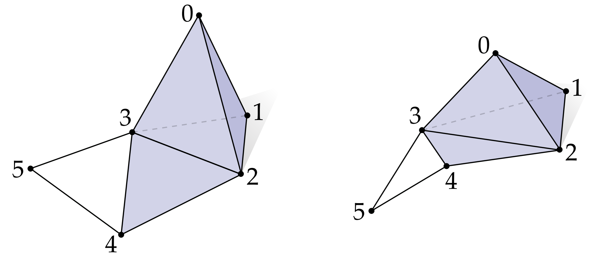

# 抽象单纯复形

我们如何通过有限数量的信息对曲面进行编码，从而可以区分球面和环面？从现在看是，我们先忘掉形状或者*几何*(大小、厚薄等)，专注于*连接关系*：哪片曲面和哪片曲面连起来，怎么连起来的？

图1： 抽象单纯复形指定顶点如何连接，但不指定它们在空间中的位置。 例如，上面的两个图形都表示同一个单纯复形，由六个顶点、十个边、五个三角形和一个四面体组成。

有许多不同的方式来描述离散表面的连通性； 一种方法是使用单纯复形——实际上它可以编码比表面更复杂的对象。 基本思想是从顶点的集合$ \mathbf{V} $开始，我们将这些顶点通过整数进行编码得到集合：

​                                                                                                           $$ \mathbf{V} = \set{0, 1, 2, \cdots, n} $$

另外，我们需要一些额外的信息描述这些顶点是何如连接的。单纯复形的想法是指定这些顶点的子集，它们“从将顶点连接起来”，称为k单形。数字 $k \in \mathbb{Z}$是一个非负整数，告诉我们这个集合中有个元素：一个抽象的 k-单形是一组 (k + 1) 个不同的顶点，我们称 k 为单纯形的度数。 例如，一个三角形或 2-单形：

​                                                                                                                     $$  \set{3, 4, 2}$$

边是一个1-单形：

​                                                                                                                      $$  \set{3, 5}$$

从几何上，我们可以认为2-单形是一个三角形，1-单形是一条边，正如图1左边化的，而0-单形就是一个独立的点。
