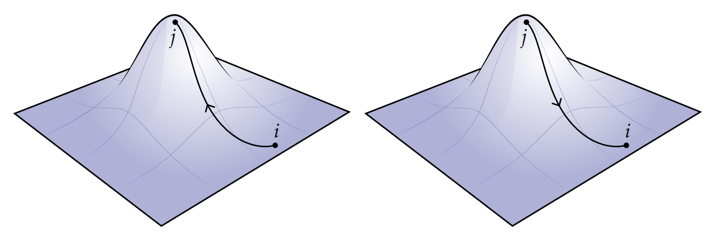
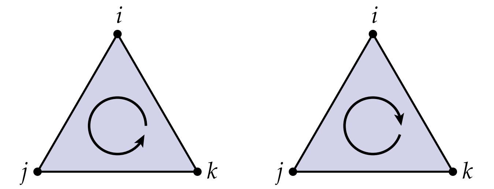
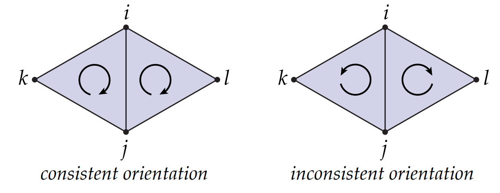

# 定向单纯复形

到目前为止，我们认为顶点的序不重要，因此我们直接使用了*集合*这个术语，比如说单形$\left\{i, j, k\right\}$和单形$\{j,i,k\}$（或$\{k, j, i\}$)是同一个三角形。但实际上很多情况这两者在朝向上是有区别的，因为很多时候朝向给出了我们需要测量或者使用的信息。比如，如图所示，从山脚到山顶的海拔变化与从山顶到山脚的海拔变化相反。

为了存储朝向这个信息，我们将使用有序元组代替无序的集合。例如对于同一条边上的两个点$i,j\in V$，我们用$(i,j)$和$(j,i)$来代表两个不同的有向二元组。前者表示从$i$指向$j$的有向边，后者表示$j$指向$i$。对于更高维度的单形(三角形，四面体等)，这个表示会稍微复杂一点。考虑一个三角形上的三个点$i,j,k \in V$，我们会得到6个不同的三元组:$(i,j,k),(i,k,j),(j,k,i),(j,i,k),(k,i,j),(k,j,i)$。每个三元组表示了一种遍历三角形顶点的方法，这6种方法实际上可以分为两大类：顺时针和逆时针，如图所示：

也就是说，我们不关心开始的顶点是哪个，只要两个三元组遍历的方向相同，它们俩是同一个等价类。因此，要指定一个有向三角形，我们只给出一个有代表性的三元组索引，而不是挑出一个特定的元组。因此：

$$  ijk := \left\{(i,j,k),(j,k,i),(k,i,j)\right\}$$

$$  ikj := \left\{(i,k,j),(j,i,k),(k,j,i)\right\}$$

更一般地，对于任意k单形，我们也定义两种顺序的集合：顶点奇排列的集合和定点偶排列的集合。比如对于一条边，我们有$ij = \left\{(i,j)\right\}$和$ji=\left\{(j,i)\right\}$，三角形$ijk$和$jki$如上所述，四面体有$ijkl$和$jikl$两种。（注：它们类似于行列式中逆序数的计算，交换两个排列，则多出一个负号，从而可以通过正负区别这两种类型。）对于0单形，它只有一个点，因此只有一种方向。如果两个有向单形共享顶点，那么我们需要讨论它们的相对方向。例如$ijk$和$jil$有相同的方向(它们都是逆时针)，然而$ijk$与$ijl$则方向不同。

实际上三角形$\{i,j,k\}$和三角形$\{i,j,l\}$共享边$\{i,j\}$，如果这两个三角形同向，那么它们在各自单形中有向边方向相反。例如$ijk$和$jil$同向，但是$ij$和$ji$反向。更一般地，如果k单形$\sigma_1$和$\sigma_2$共享k-1个顶点，如果它们同向，则必然在它们各自这个中的k-1点表示的k-1单形反向。另外，如果$\sigma'$是单形$\sigma$的恰当便，那么它们的方向是一致的(注：对于三角形$ijk$，围成三角形的边$ij$、$jk$、$ki$是它的恰当面，它们的方向是一致的)。有一个特列是0单形和1单形，例如$ij$表示从$i$指向$j$的有向边，我们约定它的方向和$j$相同，但和$i$相反。

一个（抽象）定向单纯复形是一个抽象单纯复形，其中每个单纯形都被分配了一个方向。 即，我们从一个最简单的单纯复形开始，为每个单纯形随意选择两个方向之一。虽然我们经常假设如果两个共享k-1单形的k单形方向相同，但抽象定向单形的原始定义并没有这个要求。