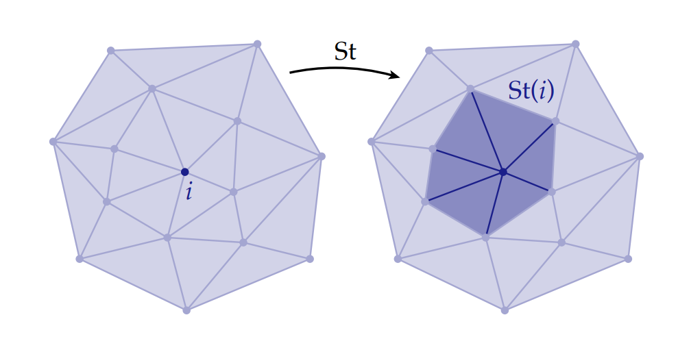
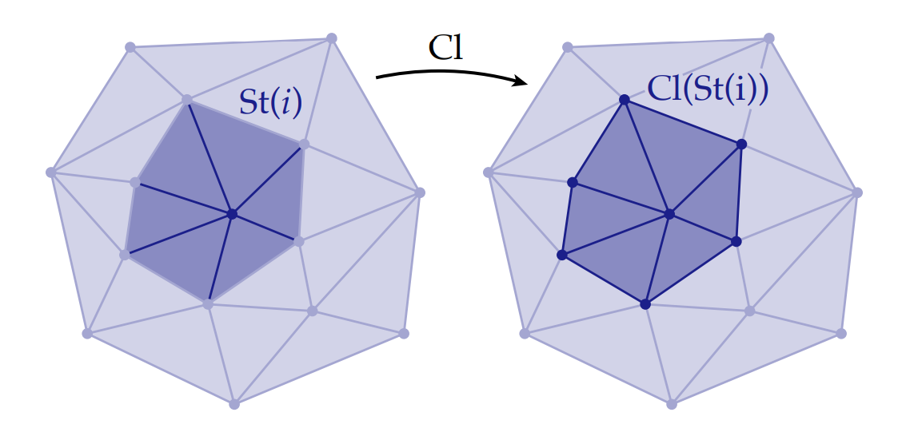
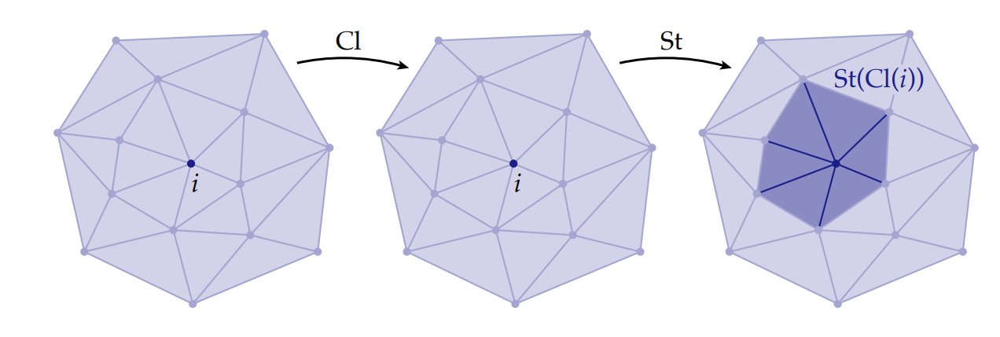
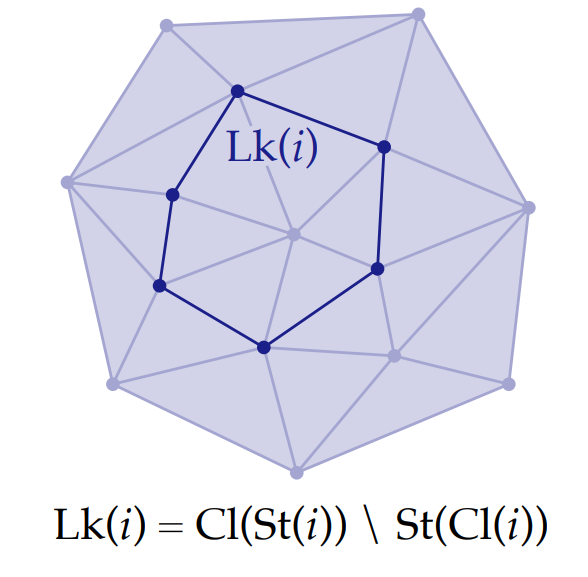
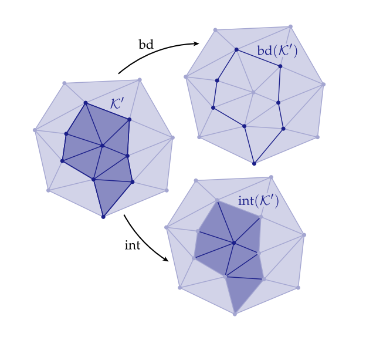

# 单纯复形上的基本运算符：Star, Closure, Link

在处理单纯复形时，能够快速简洁地访问各种元素和区域会很有帮助(例如一个顶点周围的点、边、面等)。首先，我们考虑单个顶点$i \in V$，对这个顶点进行star运算(和**hodge star**运算不同)表示获取引用了这个顶点的所有单形$\sigma \in K$，记作$St(i)$，如下图所示：

从图上可以看出，$St(i)$表示的是$i$的邻域，但是这个邻域实际上不是一个单纯复形，因为它的每个三角形都少了一条“对边”。为了得到一个复形，我们可以考虑计算$St(i)$的闭包，即给出运算$Cl$，记作$Cl(St(i))$表示在复形$\mathcal{K}$中，包含$St(i)$的最小子复形，如图所示：

注意到上面两种运算是不存在交换律的，即$St(Cl(i)) \neq Cl(St(i))$，我们给出$St(Cl(i))$定义，首先是对一个点计算它的闭包，实际上还是这个点(包含一个点的最小子复形显然还是点)，然后再计算点的闭包的star，实际上复合后得到的运算就是点的star，也就是说$St(Cl(i)) = St(i)$，如下图所示：

这两个运算($St(Cl(i)),Cl(St(i))$)的差，给出了定义链：$Lk(i) = Cl(St(i)) \setminus St(Cl(i))$，如图所示：

对于一个子集(未必要求复形)$S\subset \mathcal{K}$，上述三个运算更一般的定义如下：

* $St(S)$定义为$\mathcal{K}$中包含这个子集任意一个部分的所有单形的集合
* $Cl(S)$定义为$\mathcal{K}$中包含这个子集的最小复形
* $Link(S) = Cl(St(S)) \setminus St(Cl(S))$

有一个和上述概念相近的概念，*边界*，一个 k复形$\mathcal{K}'\in \mathcal{K}$的边界$\mathtt{bd}(\mathcal{K}')$是所有单形$\sigma$的集合的闭包，而每一个单纯形$\sigma$恰好是$\mathcal{K}'$的某个单形的适当面(注：如图所示，边界的一条边，正好是某个$\mathcal{K}'$中的三角形的边，或者说正好是某个三角形的恰当面)。这个定义正好捕捉了一个集合的边界，如图所示：

有了边界后，*内部*的定义是很自然的：$\mathtt{int}(\mathcal{K}') = \mathcal{K}' \setminus \mathtt{bd}(K)'$，如上图所示。

一般来说，这些运算符（star, closure, link, boundary, and interior）提供了一种自然的方式来描述任何维度中的任何类型的单纯复形。 事实上，它们给出了太过普适性的定义，我们关注的简单的组合曲面所需要的操作符远比这些定义简单。后续，我们将介绍一种在*组合曲面*中常用的查询邻域的结构，称为*半边网格*。如果我们不关心一般情况，它在某些方面更容易使用。但要做到这一点，我们首先定义*组合曲面*——为此，我们需要star,closure和link运算符。
