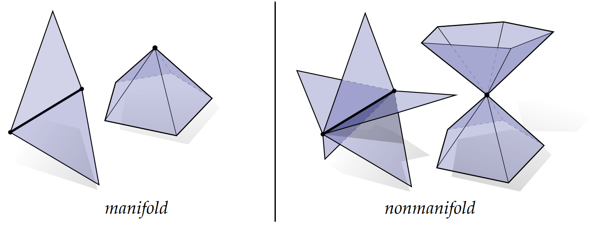
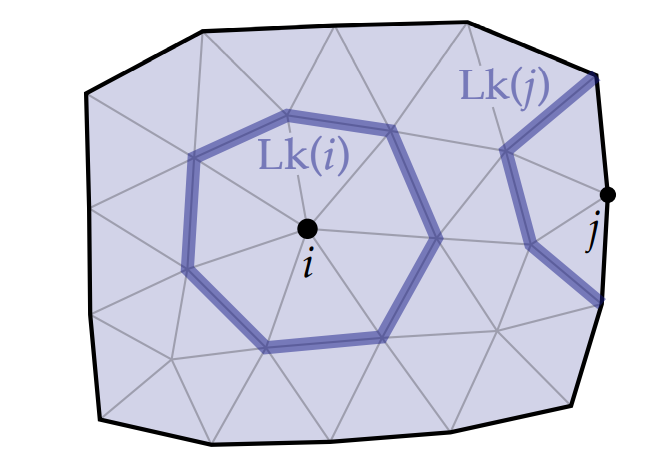
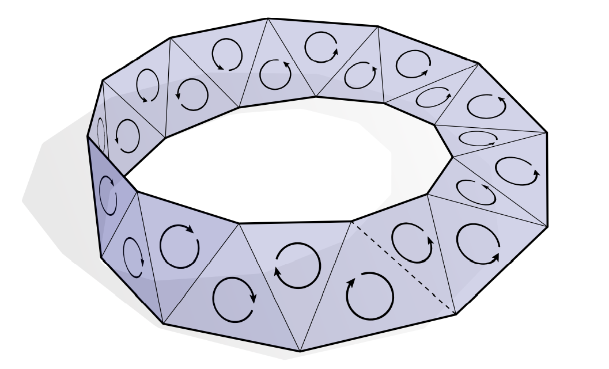

# 单纯曲面

正如本节开头所提到的，一般单纯复形比我们研究普通形状（例如：帽子、脸、心、香蕉，这些形状都可以被曲面很好地描述）所需的数学工具更具有普适性。 因此，使用抽象的单纯曲面通常就已经足够日常应用了。 一个抽象单纯曲面是一个单纯 2-复形，其中对每个顶点进行link运算得到的是一个圈，或者等效地。对每个顶点进行star运算得到的是由三角形组成的组合圆盘。 每个顶点都有一个“盘状”邻域这一事实抓住了拓扑曲面的基本思想； 因此，我们说这种单纯复形是流形。

与一般单纯复形不同，单纯曲面不能有像三个三角形在一个边上相交，或者多个“锥体”的共用一个顶点之类的情况。我们将称此类情况称为非流形：

对于Link算符的定义，我们将其拓展，在边界时，Link可以是一条与边界连接的简单路径，而不是一个圈，如图所示：

对于任意单纯曲面$\mathcal{K}$ ，其边界 $\mathtt{bd}(\mathcal{K})$ 必然是（零个或多个）闭环的组合。

*定向单纯曲面*是一个抽象单纯曲面，我们可以在其中为每个三角形分配一致的方向，即，任意两个共享公共边的三角形都具有相同的方向。 我们认为如果单纯曲面的任意两个三角形可以一致定向，那么这个单纯曲面有向曲面。这个定义可行吗？乍一看，这似乎很简单：从一个任意三角形开始，为其指定任意方向，然后“向外生长”，为你遇到的每个三角形指定一个和之前一致的方向。但问题是，在某些时候（如果曲面是不可定向曲面），当曲面绕一圈回来后会发现无法为新给出的方向无法兼容原来三角形的指定方向。 例如考虑这个组合莫比乌斯带：

这种不可定向曲面在实际生活中往往不存在，尽管它确实值得关注。

我们对单纯曲面的定义很容易扩展到高维：（组合或抽象的）单纯 n-流形是纯单纯 n-复形，其中对每个顶点的link运算得到的链都是单纯 (n-1) 球。 单纯n球指的是是n维球$ \mathbb{S}^n := \left\{x\in \mathbb{R}^n \mid |x| = 1\right\} $的三角剖分。一个单纯曲面是一个2流形，它上面的任意一个链都是$\mathbb{S}^1$，即一个圈。一个单纯3流形是四面体组成的网格，它上面每一个顶点都被三角形构成的球面包围。

到目前为止，我们已经讲了很多关于单纯曲面的内容，它们已经足以让我们用以定义半边表，它将是我们以后用于访问单纯曲面各种元素的基本数据结构。
