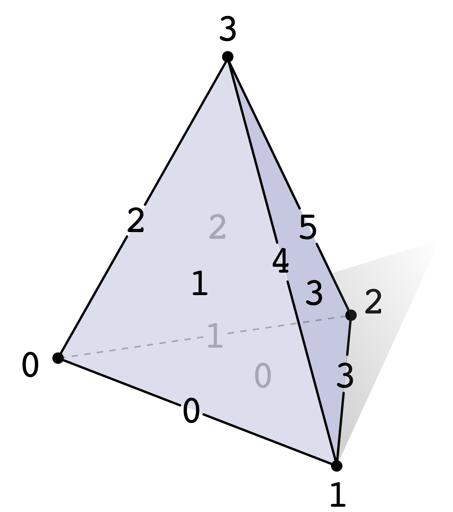
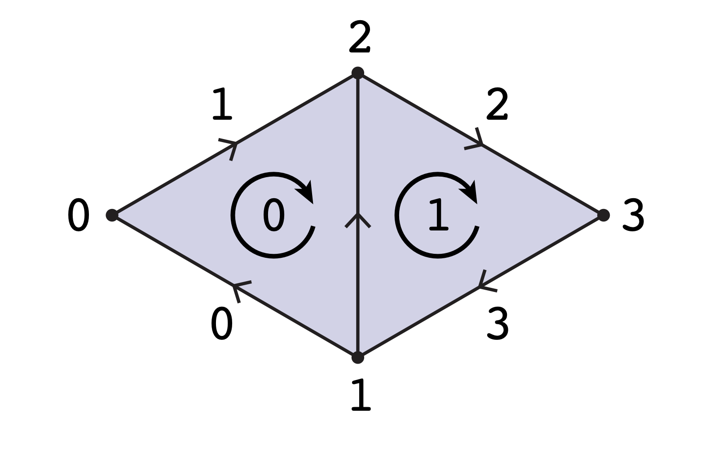

# 邻接矩阵

对抽象单纯复形进行表示的一种比较好的方式是使用邻接矩阵，单纯复形的计算使用邻接矩阵特别容易（只需要通过数值线性代数进行矩阵操作即可）。 这些矩阵还与离散微分形式密切相关，这为我们的许多几何算法提供了基础。 

我们要做的第一件事是为不用类型的的单纯形分配不同的索引。比如我们的单纯复形由顶点$V$，边$E$和三角形$F$组成，我们会给顶点分配$0, \cdots,|V| - 1$的索引，给边分配$0,\cdots,|E|-1$的索引，给面分配$0,\cdots,|F|-1$的索引。我们不关心哪个三角形一定要分配到第几号索引，我们需要的仅仅是一个索引队形一个三角形。比如，如下图所示，一个2复形，我们给所有的点、边和面都分配了索引：

为了描述单形是如何连起来的，我们使用矩阵$A_0$，用于描述了哪些边连接了哪些点；$A_1$用于描述哪些三角形使用了哪些边，以此类推。如何描述呢，是这样的：如果第r条边引用了第c个点，那么我们将$A_0$的第r行第c列元素设置为1，其他设置为0；如果第r个三角形引用了第c条边，那么矩阵$A_1$的第r行第c列设置为1，其他为0，以此类推，$A_k$的列的数量和k单形的数量一样多，行的数量和k+1单形的数量一样多。正常来说，我们的矩阵只有少量元素是1，大量元素是0，而且矩阵维度特别大，因此它实际上是一个超大规模的稀疏矩阵，我们可以用存储稀疏矩阵的所有方式来存储这种矩阵。

如果我们的复形是定向的，我们需要构建带符号的邻接矩阵，它在记录连接性的同时，还记录了连接方向。和前者不同之处在于如果两个单行方向是一致的，那么矩阵的元素设置为+1，否则设置为-1。