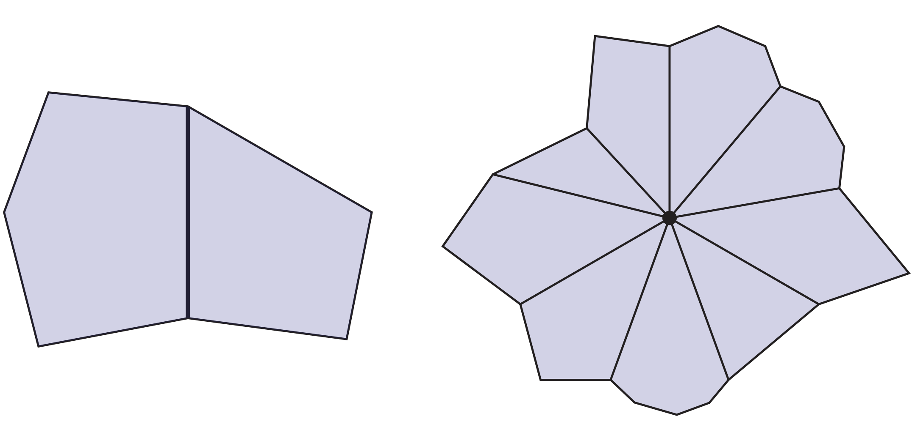
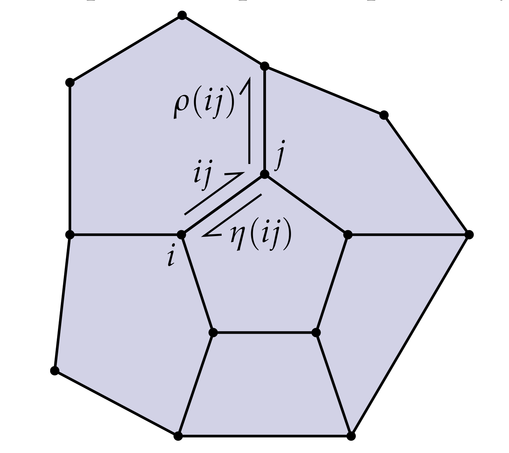
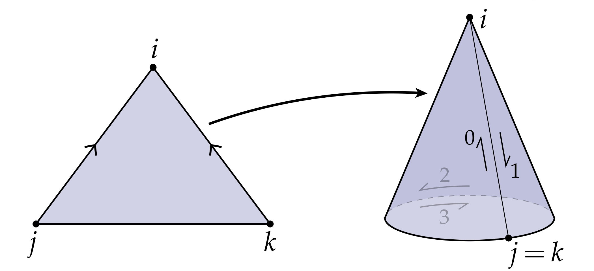
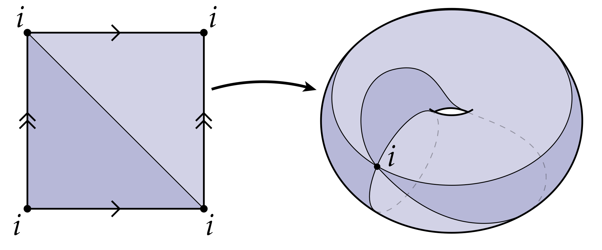
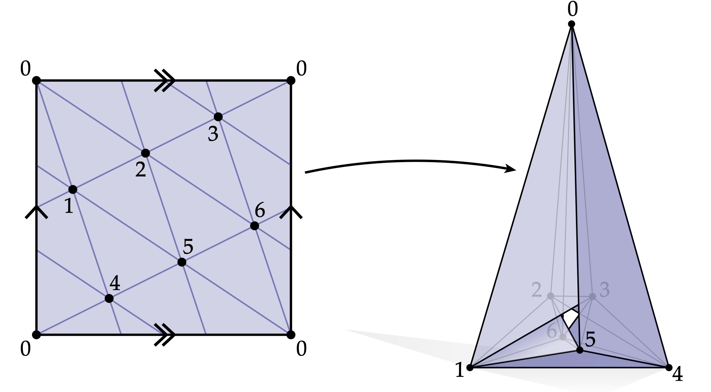

# 半边表

正如我们前面讨论的，生活中大量形状都可以用保定向的2流形来表示。我们给出最后一种描述这种定向2流形的数据结构，半边表。这种结构相比于领邻接矩形来说，既不能表示不定向曲面（类似莫比乌斯环这样的）、也不能表示更高维的流形(3流形以上便失效了)，但是他极易用于描述组合曲面，即便组合曲面是多边形而不是三角形，它也能适用。形式上，半边表实际上暗含了2流形的CW复形（胞腔复形，定义可参考[Hat02,Chapter0]）。

从我们在 2.3 节的讨论中，我们可以注意到关于任何有向单纯曲面$\mathcal{K}$（现在我们假设它没有边界）具有一些性质：

* 每条边都被两个面引用
* 环绕一个顶点的所有边可以练成一个圈

事实上，如果我们的表面是由n边形而不是三角形构成的，则这些命题仍然成立，如图所示：

为了描述这样的组合曲面，半边表提供了一种很好的方式。这个结构的基本想法是，对于任意一条不定向的边$\{i,j\}$，我们将它的两个定向的半边$ij\neq ji$存储为2个半边。我们用$H$来表示所有半边的集合，显然半边的数量是边数的2倍，即$|H|=2|E|$。

我们需要在半边表上定义一些结构来描述定向曲面是如何连接起来的。最简单地，就是定义两个映射：twin和next。映射twin用$\eta : H \rightarrow H$表示，定义为:

$$ \eta(ij) = ji $$

也就是说，将这个映射作用到一个半边上，得到的是同一条边上的另一个半边。另一个映射用$\rho: H\rightarrow H$表示，定义为：

$\rho(ij)=ji \qquad \forall ijk \in \mathcal{K}$

也就是说，将这个映射作用到半边上，得到时是它的下一条半边，如图所示：

我们很容易通过映射$\rho$和$\eta$访问多边形网格上的点、边和面。比如我们从某个半边$i_1i_2$开始，我们作用$\rho$，$\rho(i_1i_2)=i_2i_3$,$\rho(i_2i_3)=i_3i_4$，不断进行，最终会回到半边$i_1i_2$。换句话说，我们要访问网格上的一个面，可以通过映射$\eta$不断访问下一条半边，从而连成一个封闭的轨道达成。那么$\eta$这个映射可以给我们带来什么好处呢？首先，对于任意半边$\eta(ij)=ji$，然后再次作用$\eta(ji)=ij$，这就描述了一条边。对于顶点来说，我们需要使用复合映射$\rho \circ\eta$来生成轨道，也就是说我们先作用twin然后再访问next，之后又是twin然后再next,...,直到重新获得最初的半边为止。总结一下：

* 面通过$\rho$生成轨迹访问
* 边通过$\eta$生成轨迹访问
* 点通过$\rho\circ\eta$生成轨迹访问

实际上，只要映射$\eta$和$\rho$满足一些基本性质，就可以描述组合曲面：(i)集合$H$有偶数个元素，(ii)$\eta$和$\rho$都是在这个集合上定义的置换映射，(iii)$\eta$是一个没有不动点的集合，即$\forall ij \in H, \eta(\eta(ij)) = ij$且$\eta(ij)\neq ij$。最后一个条件描述的是这样一个常识：你的孪生兄弟的孪生兄弟是你自己，你不是你自己的孪生兄弟。只要$\rho$和$\eta$ 满足这三条性质，那么我们就可以通过他们生成轨迹来访问组合曲面。

事实上，如果我们以一种特殊的方式给我们的半边定义索引，这样我们就不需要显式定义$\eta$。 特别地，假设我们将索引0和1分配给第一对半边，将2和3分配给下一对半边，以此类推。 那么$\eta$就有一个很简单的方法：任意索引为偶数h的twin是h+1； 任何索引为奇数h的twin是h-1。有了这个规律，我们只需要定义映射$\rho$即可描述组合曲面。

注意到，其实对于三角形构成的曲面，半边表甚至可以描述单纯复形无法描述的情形，如下图：

我们通过将三角形两条边粘在一起得到了一个锥体。如果我们用一个单位圆盘填充锥体的底面，那么在整个锥体上我们有4条半边，其中三角形有3条:$h_0,h_1,h_2$，圆盘上有一条$h_3$(我们在三角形上和圆盘上各有一个圈)。twin可以这样定义:$\eta(h_0)=h_1$，$\eta(h_2)=h_3$，表示这个圆锥是怎么粘起来的；next也有相应的定义$\rho(h_0) = h_1$,$\rho(h_1)=h_2$,$\rho(h_2)=h_0$，以及$\rho(h_3)=h_3$，表示他们各自面上的循环。这种圆锥是无法使用单纯复形描述的：单纯复形必须要能够指定出三角形$ijk$，我们无法描述粘合这种行为。同样，它也无法描述圆盘，因为圆盘甚至不是一个普通的多边形。这里有另一个有趣的例子：

我们可以用两个相连的三角形粘成一个圆环，粘上之后他就只剩1个点，我们无法用三角形描述这种形式，因为$\{i,i,i\}$根本不是一个集合。即便我们允许这种集合，我们也无法区分三角形$iii$和$iii$，也无法说清这些三角形是如何粘起来的。半边表只需要很少的元素就能轻易描述这种圆环，但是单纯复形不行，它至少需要7个顶点，21条边和14个三角形，如图所示：

上图左边是一个方块，想象方块的左边右边站起来，上面下面粘起来，最终得到右边这样的结构，它和圆环的拓扑相同，但它的边与面都是平直的，且在$\mathbb{R}^3$中不存在自相交情况，这个几何形体就是著名的Csa ́sza ́r多边形。

在实际应用层面，半边表给我们的算法提供了很好的基本数据结构，我们后续算法中都会依赖于它。通过巧妙地使用"next"和"twin"，我们很容易访问我们需要访问的数据。最后还剩下一个问题，即如果我们的曲面有边界怎么办(比如圆盘和圆环面)？这些似乎违反了我们的一个基本公理，即每条边都包含在两个多边形中。一个最简单的处理方式是将边界看成一个多边形的边。换句话说我们只需要"补洞"即可得到一个面，将边缘看成这个面的边。对于外边界我们可以看成是一个无界面的边缘。最终化归为之前讨论的没有边界的曲面问题，照先前的方式即可处理这类曲面。 
