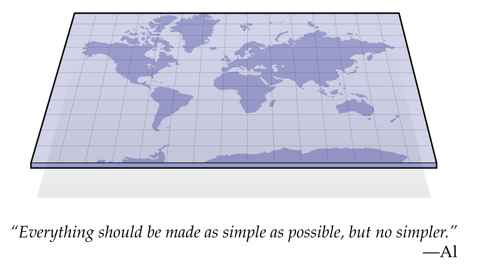
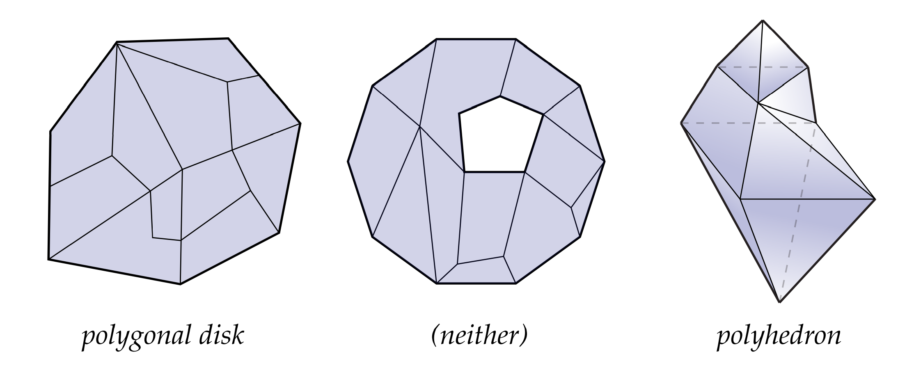

# 组合曲面

曲面，或者粗略地说，"有形状的外壳"，比如你可以把整个橘子看成一个实心球；它的果皮描述子整个球面(特别是如果我们考虑一个理想的情况，果皮厚度为0)。我们日常生活中遇到各种不用的物体，它们的边界都可以被描述为不同的曲面。比如，覆盖在甜甜圈上的釉料构成了一个圆环而不是球面。(希望句子和甜甜圈让你对几何感到饥渴)。作为学习曲面微分几何的前奏，我们首先从易于理解的纯粹离散的观点*组合曲面*（combinatorial surfaces）切入，或者从形状的描述切入(告诉你曲面是如何拼在一起的，而不是告诉你具体它在空间中的哪个位置)。在离散微分几何中，组合曲面有效的代替了光滑曲面中拓扑曲面的角色。我们不会在这本书中深入研究拓扑，但是使用离散曲面看上去没有讲几何，但是却可以给你的抽象的拓扑知识提供一个很好的直观认知。实际上我们会从好几个不同的角度来描述组合曲面的连接关系：*抽象的单纯复形* 、*邻接矩阵*以及*半边表*。这些表示方式都被用于各种丰富的几何物体在计算机中使用，也暗含在我们之后即将讲述的算法之中。（如果你想学习更多的技术，可以看看Hatcher’s的讲代数拓扑的书[Hat02]）

爱因斯坦曾说过：“几乎不能否认，所有理论的最高目标都是使不可约的基本要素尽可能简单，尽可能少，而不必放弃对单一经验数据的充分表述。（It can scarcely be denied that the supreme goal of all theory is to make the irreducible basic elements as simple and as few as possible without having to surrender the adequate representation of a single datum of experience.）”。我们将对网格的形状进行一些假定，但仍然保留足够的空间用于描述各种各样的基本物体。这些简化既可以更轻松地建立几何名词（例如曲率）的清晰描述和定义，也将最终帮助我们构建无需考虑大量特殊情况和极端情况的精简、清晰的算法。对微分几何的基本假设是我们处理的网格都是*流形*。粗略地解释一下这句话的意思就是，至少在显微镜观察这个形状，这个形状和普通的平面是一样的。例如，站在地球表面，你很难说自己不是站在平面上。流行假设是很有用的，因为它让我们可以将欧几里得空间中习得的经验迁移到弯曲空间中（比如：向量、微分、积分等）。事实上，有许多不同的方式可以使形状“看起来像欧几里得空间”，从而导致微分几何的许多不同子领域（微分拓扑、共形几何、黎曼几何等）。到目前为止，我们只关注曲面的一个基本性质，即任何点周围都能找到一个小邻域，而这个邻域是一个拓扑圆盘。

什么是拓扑圆盘呢，简单说就是如果你给出的形状，通过不包括撕裂、穿刺、边缘粘合的变形能得到一个平面的单位圆，那么这个形状就是一个拓扑圆盘。比如生活中常见的旗帜、叶子和手套都是拓扑圆盘。非圆盘形状的一些示例：包括单位圆（即没有内部的圆盘）、实心球、球面、甜甜圈、指尖陀螺和茶壶等。如上图所示，我们有一个拓扑圆盘（左）、一个拓扑环（中）和一个拓扑球面，它们是通过沿边将有限数量的多边形粘合在一起而制成的。

在本章中，我们将从定义一个*抽象单纯复形*的定义开始，它将形状分解为简单的元素，如边、三角形和四面体。任何抽象的单纯复形能被编码为*关联矩阵*，这些关联矩阵实际上就是一个巨大的表格，它编码了哪些元素连载一起。由于这种描述方式可以表达一些非常复杂的形状，因此它通常不仅仅只用于离散微分几何中。半边表，它是专门为二维曲面定制的，它可以轻松地描述具有一般多边形面（而不仅仅是三角形）的曲面。它将作为我们这本书中大多数算法的数据结构。在本章的最后，我们将做一些练习来揭示组合曲面的一些有趣、有趣和有用的特性。
