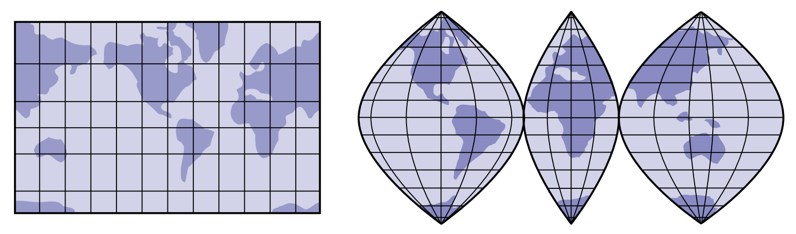
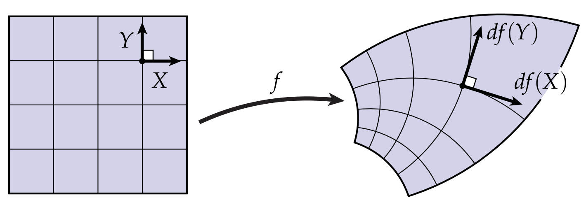

# 共形坐标系

当我们研究曲率时，我们通常引入等距参数化的概念。这个想法是通过假设当我们将向量从$\mathbf{M}$推前到$\mathbb{R}^3$时不会发生“拉伸”，从而简化某些表达式。这个不发生拉伸条件用数学语言表达为：

$$ |df(\mathbf{X})| = |\mathbf{X}| $$

也就是说，向量$\mathbf{X}$的模长不变。

但是，对于曲面来说，等距参数化不总是存在(即使在局部也不总是存在)。大多数时候，共性参数化只需要把曲面摊开即可。但实际上你不可能将地球的表面摊平到纸上，而不引入任何畸变。这就是为什么，我们需要对地球表面做各种不同的畸变。

虽然没办法找到等距，但是我们可以折中一下，找一个共形，来使得很多表达式得到简化。简单来说，如果映射$f$保持任意两个向量之间的角度，则它是共形的。用数学的语言描述：一个共形映射，是一个映射$f : \mathbb{R}^2 \supset \mathbf{M} \rightarrow \mathbb{R}^3$，满足：对于任意切向量$\mathbf{X} ,\mathbf{Y}$，存在一个正的尺度参数$a$，使得

$$ df(\mathbf{X}) \cdot df(\mathbf{Y}) = a\langle \mathbf{X}, \mathbf{Y} \rangle $$

恒成立，其中$\langle \cdot, \cdot \rangle$表示$\mathbb{R}^2$中的向量内积。再实际使用中，我们常常用$e^u$来代替$a$，这样我们不需要总是约束尺度参数为正数。请注意，向量仍然可以被拉伸，但表面永远不会被剪切(也就是说任意两个向量不会有相对旋转)——例如，正交向量始终保持正交： 

根据[单值化定理](https://en.wikipedia.org/wiki/Uniformization_theorem)，曲面上的共形映射始终存在。单值化定理表明，任何单连通，只有一条外边界的曲面都可以共形映射到平面上。因此，如果我们考虑曲面$f(\mathbf{M})$上的任何点$\mathbf{p}$，根据单值化定理，我们总是可以在$p$周围的一些小的、盘状的邻域中找到共形参数化。 我们通常只需要知道共形映射的存在性，而不需要找到一个方法去构造这个映射。对于这个映射而言，我们只需要保留一些很少的信息，即一个点被拉伸了多少(而不是整个雅可比矩阵)，即可表示整个映射，
