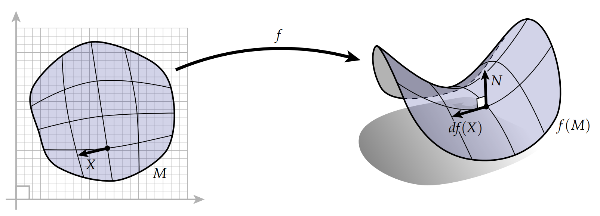
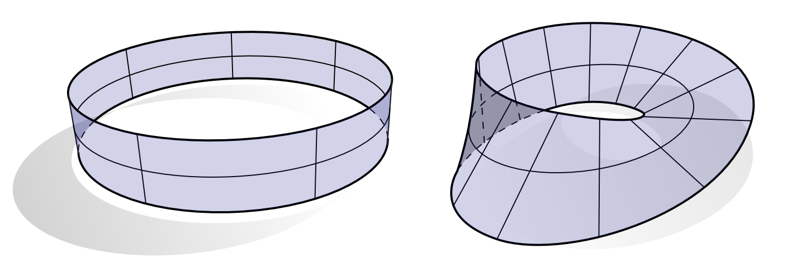
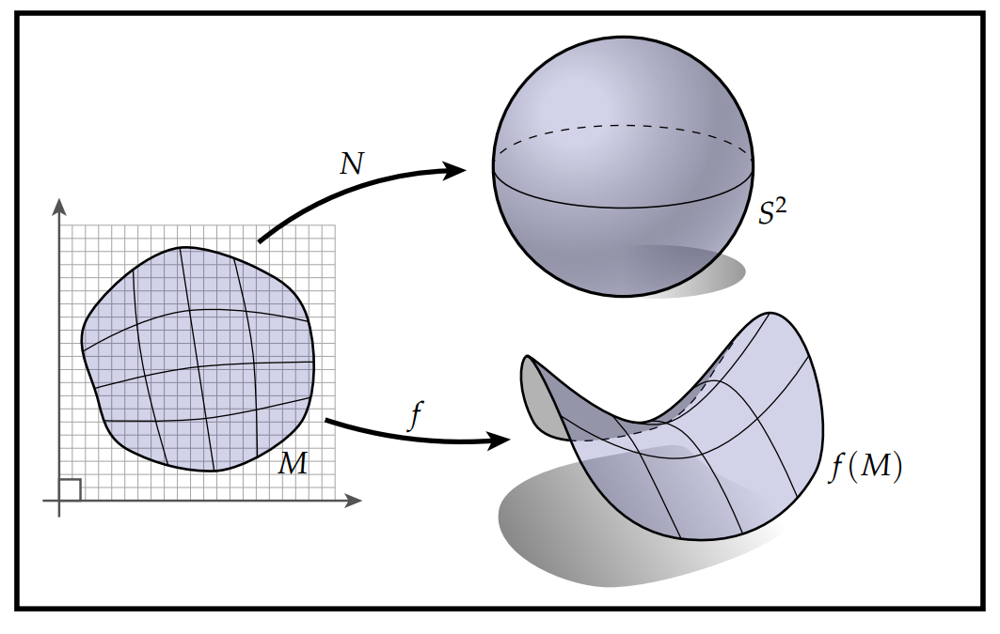

# 曲面微分几何

学术上有很多方式用于研究光滑曲面的几何性质(比如使用坐标卡)。下图给出了一种比较适合用于推广到离散情形的描述方法。考虑漂浮在空中的一小块物质，它的几何特征可以通过一个从区域$\mathbf{M}$到欧几里得空间$\mathbb{R}^3$的映射$f:\mathbf{M}\rightarrow \mathbb{R}^3$来描述：

对这个映射的微分，记为$df$，它描述了平面上的向量$\mathbf{X}$是如何映射到曲面上对应向量$df(X)$的。粗略地说，想象$\mathbf{M}$是一个橡胶板，$\mathbf{X}$是画在$\mathbf{M}$上的一条短线段。当我们将$\mathbf{M}$拉伸弯折成$f(\mathbf{M})$时，$\mathbf{X}$也会被拉伸弯折成得到新的一小段，这个新的小段被称为 $df(\mathbf{X})$。稍后我们将讨论如何在坐标等中明确表达$df (\mathbf{X})$，但目前来说，更重要的是要意识到，没有什么比你在这里看到的图片更能了解微分的了 。这个微分操作告诉我们向量是如何从一个空间推前到(push forward)另一个空间的。比如一个切向量$\mathbf{X}$被$f$推前后得到的向量$df(\mathbf{X})$的长度可以表示为：

$$ \sqrt{df(\mathbf{X})\cdot df(\mathbf{X})}$$

其中$\cdot$表示在$\mathbb{R}^3$中的经典内积。注意到这里的长度和我们的向量$\mathbf{X}$的长度是不同的。为了描述清楚这个情景，我们将用尖括号表示平面上的内积，即原来向量的长度表示为$\langle \mathbf{X},\mathbf{X} \rangle$。更一般地，我们可以度量两个向量$df(\mathbf{X})$和$df(\mathbf{Y})$的内积：

$$ g(\mathbf{X},\mathbf{Y}) = df(\mathbf{X})\cdot df(\mathbf{Y})$$

我们将$g$称为曲面上的度量(metric)，更精确地说，是被映射$f$诱导出的度量。后续我们将始终使用$df(\mathbf{X})$来表示单个向量和整个向量场($\mathbf{M}$上每一点都给出一个向量，称为$\mathbf{M}$上的向量场)的推前映射。大多数时候，这个表述不会带来歧义，但却值得重点区分它们。在整本书中，我们使用$TM$来表示$\mathbf{M}$上的切丛，即所有切向量的集合。

到目前为止，我们已经讨论了切向量，我们同样关心垂直于曲面的那些向量，对于某一点$\mathbf{p}$处的法向量$\mathbf{u}\in\mathbb{R}^3$，它定义为：对于所有$\mathbf{p}$处的向量$\mathbf{X}$，满足

$$ df(\mathbf{X})\cdot \mathbf{u} = 0$$

为了方便起见，我们用$N$表示单位法向量。但是给定一个点，我们往往有两个法向量$+N$和$-N$，我们选择哪个呢？首先，如果一个曲面具有一致地法向量，那么这个曲面是可定向的，比如左边那个带是可定向的，但右边的莫比乌斯带是不可定向的：

对于可定向曲面，我们可以认为$N$是一个连续映射(称为高斯映射)$N:\mathbf{M} \rightarrow \mathbb{S}^2$，他将曲面上的每一个点映射成一个单位向量(或者球面上的一个点)。事实上，如果我们认为$\mathbb{S}^2$是$\mathbb{R}^3$的子集（距离单位元距离为1的那些点的集合），之后，我们对$N$做和映射$f$一样的操作，即微分。$dN$(称为Weingarten映射)，它反映了法向量的方向随着我们移动曲面上的点的变化。例如，我们可以通过计算$dN(\mathbf{X})$来考察法向量沿着切线$\mathbf{X}$方向的变化——当我们研究曲面曲率时，这个映射非常有用。总的来说，我们以下面的图片结束，它捕获了关于曲面几何的最基本的想法：

