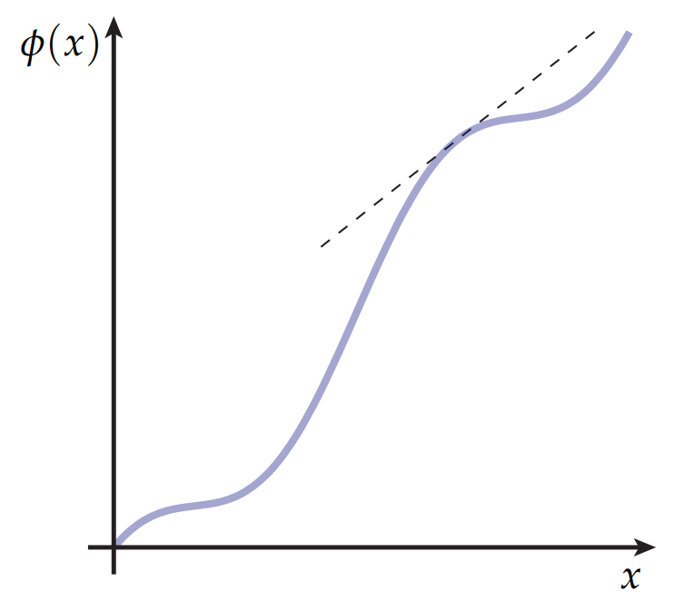
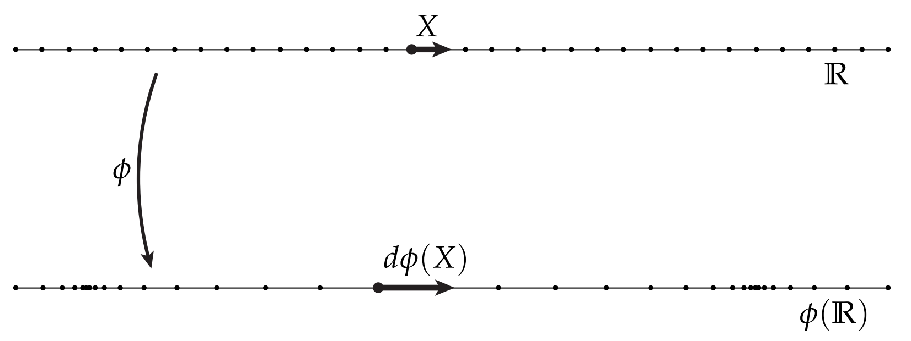

# 坐标轴上定义的曲线及其导数

到目前为止，我们一直在以一种非常几何的方式思考微分：它告诉我们当我们从一个地方到另一个地方时，如何拉伸或向前推切向量。 事实上，我们可以将这种几何观点应用于几乎所有涉及导数的情况。 例如，考虑坐标轴上的定义的一个实值函数$\phi(x)$。 我们通常通过将其值绘制到平面直角坐标系上:

在这种情况下，导数$\phi'$可以解释为高度函数的斜率，如上图中的虚线所示。 或者，我们可以想象$\phi$延长了实轴本身，由这张图片中节点间距的变化表示： 

当导数较大时，节点间隔较远；当导数很小时，节点间距很近。这幅图启发我们写出$\phi$的导数，即将沿正$x$轴的单位向量$\mathbf{X}$的向前推成$d\phi(\mathbf{X})$：

$$  \phi'=d\phi(\mathbf{X}) $$

换句话说，$\phi$的导数就是一个从一个向量推前成另一个向量的"拉伸因子"。值得注意的是，上面这个等式是有些问题的，因为等号左边是一个数，右边是一个向量。当然，实线上的任何切向量都可以表示为单个值，它的正负号给出了它的方向，大小给出了长度。所以这个表达式是有意义的，只要我们知道，我们用实数$R$表示实轴上的切向量。通常，这种简单的“类型检查”可以帮助验证公式和表达式是否正确，类似于物理方程中用的量纲分析方法。 

这里还有一个问题：导数的这种解释与我们通常对高度函数的解释有什么不同？在那种情况下，我们不是也拉长了原来的直线吗？ 其实不是那么确切的。在高度函数那种情况下，曲线是$\mathbb{R}^2$的一个子集，即曲线$\gamma = (x, \phi(x))$，注意到$\phi'$是一个数，$d\gamma$是一个2维向量，但更为关键的是，它的拉伸系数不是简单的$\phi'$，我们计算$d\gamma$的模长得到的值$|d\gamma|= \sqrt{1 + \phi'^2}$。

