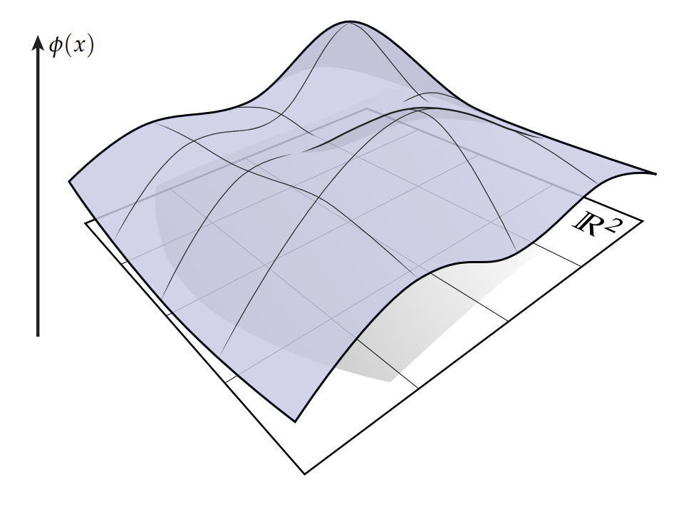
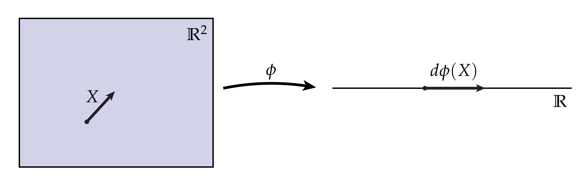

# 方向导数

正如前面讲的，我们可以将$\mathbb{R}$上的实值函数的导数视为单位切线向量$\mathbf{X}$的推前映射。 但是，如果$\phi$的定义域不是$x$轴，而是别的，比如平面$\mathbb{R}^2$，那$d\phi$意味着什么呢？这个问题可能比较难回答，但如果你能理解这个例子，那么你就可以很好地理解用切向量术语来描述的导数了。 让我们从几何上来看看这个问题——首先我们把这个函数$\phi$画出来，我们用函数值代表距离定义域$\mathbb{R}^2$的高度：

显然，导数和这座山的坡度有关，但方向怎么定义呢？为了回答这个问题，需要引入一个概念，叫做方向导数，即给定一个方向，在这个方向的上山或者下山速度。我们通过这个图来描述这个情景：

由于$\phi$是从$\mathbb{R}^2$到$\mathbb{R}$的映射，可以想象我们将一块平板橡胶沿着某个方向拉伸成一个细长的一维物品。因此，如果我们在原始坐标系上画一个箭头$\mathbf{X}$，那么“拉伸”箭头$ d\phi(\mathbf{X})$ 给出了$\phi$沿$\mathbf{X}$方向的变化率，即方向导数。接下来，我们来看看类型是否一致。和以前一样，类型是一致的：$d\phi(\mathbf{X})$ 是$\mathbb{R}$上的切向量，因此可以用单个实数表示。(思考一下，如果我们继续使用上面的高度函数会怎样？ 在这种情况下，我们如何恢复方向导数？)

顺便说一句，如果这个讨论看起来非常非正式，请不要担心！ 当我们开始讨论外微积分时，我们会看到对这些想法的更明确的代数表达。 现在重要的是建立一些关于导数的几何直觉。 特别是：从任意两个空间之间的映射都可以被视为某种弯曲、扭曲和拉伸（或者甚至可能是撕裂！）； 我们都可以根据沿小箭头发生的变化来理解导数。
