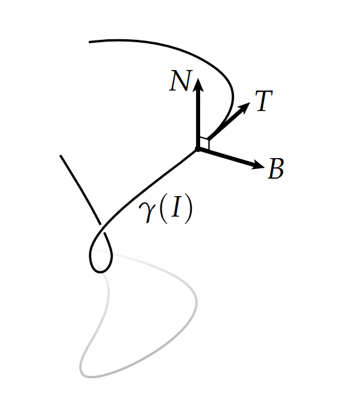

# 曲线的曲率

假设我们在区间$I$上有一个单位速度曲线$\gamma$和一个正向单位向量$\mathbf{X}$。那么

$$ \mathbf{T} = d\gamma(\mathbf{X}) $$

是一个$\mathbb{R}^3$中和曲线相切的向量。我们将这个想法更进一步，我们来研究一下切向量沿着$\gamma$是如何变化的。由于$\mathbf{T}$可能以任何速率变化我们可以将它的改变分成两个部分：描述方向变化的主法向$\mathbf{N}$和描述大小变化的曲率标量$\kappa \in \mathbb{R}$：

$$ d\mathbf{T} = -\kappa \mathbf{N}$$

注意到$\mathbf{T}$ 和$\mathbf{N}$总是正交的。 为什么？ 因为如果$\mathbf{T}$的变化与自身平行，那么它将不再具有单位长度(当你处理单位向量场时，这个观点应该时时刻刻放在你的脑海中)。按照惯例，我们选择$\mathbf{N}$作为指向曲线“左侧”的法线，即，我们认为，曲线上任意一点的切向量和法向量能张成一个平面，在这个平面中，切向量$\mathbf{T}$逆时针旋转90度的结果和法向量$\mathbf{N}$重合。我们第三个向量$\mathbf{B} = \mathbf{T} \times \mathbf{N}$称为次法线，它们一起构成了Frenet坐标系。

这个坐标系沿着曲线是如何变化的呢？答案是Frenet-Serret公式：

$$ \underbrace{\left[\begin{array}{c} \mathbf{T}' \\ \mathbf{N}' \\ \mathbf{B}'  \end{array} \right]}_{\mathbf{Q}'\in \mathbb{R}^3}  = \underbrace{\left[\begin{array}{ccc} 0 & -\kappa & 0 \\ \kappa & 0 & -\tau \\ 0 & \tau & 0\end{array} \right]}_{\mathbf{A}\in \mathbb{R}^{3\times 3}}  \underbrace{\left[\begin{array}{c} \mathbf{T} \\ \mathbf{N} \\ \mathbf{B}  \end{array} \right]}_{\mathbf{Q}\in \mathbb{R}^3} $$

在这个公式中，$\mathbf{T}、\mathbf{N}、\mathbf{B}$用行向量表示，$\kappa$和$\tau$用于刻画沿着曲线以单位速度运动时，这些向量大小的变化量。公式中的$\tau$叫做扭转，他描述了法向和次法向是如何盘旋的。

Cartan给出了这个公式的简单证明。首先$\mathbf{T}、\mathbf{N}$和$\mathbf{B}$是相互正交的，也就是说$\mathbf{Q}$是一个单位矩阵，我们对$\mathbf{Q}\mathbf{Q}^T=\mathbf{I}$两边同时求导，可以得到$\mathbf{Q}'\mathbf{Q}^T=-(\mathbf{Q}'\mathbf{Q}^T)^T$，也就是说$\mathbf{Q}'\mathbf{Q}^T$是反对称的。因此$\mathbf{A} = \mathbf{Q}'\mathbf{Q}^T$是反对称的。由于$ d\mathbf{T} = -\kappa \mathbf{N}$，因此$A_{23} = -A_{32}= 0$，即可证明上式的正确性。
