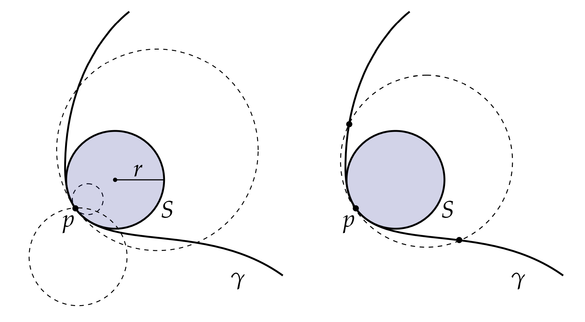

# 曲率可视化

圆$S$的曲率是多少？ 如果$S$的半径为$r$，那么以单位速度绕圆一圈需要$2\pi r$的时间。在此期间，切线以$2\pi $角旋转。另一方面，由于$\mathbf{T}$具有单位长度，因此$\mathbf{T}$的瞬时变化仅由角度的瞬时变化来描述。用数学的语言来说明这个问题，即：

$$  \kappa = |\kappa \mathbf{N}| = |d\mathbf{T}(\mathbf{X})| = 2\pi / 2\pi r = 1/r $$

换句话说，圆的曲率只是其半径的倒数。这个结论给出我们一些直观的感受：如果我们看着一个圆越来越大，它最终看起来就像一条零曲率的直线：$\lim\limits_{r\rightarrow +\infty} 1/r = 0$，类似地，如果我们观察一个圆越来越小，它最终看起来就像一个具有无限曲率的单点:$$\lim\limits_{r\rightarrow +0} 1/r = +\infty$$。

我们考虑平面上的光滑曲线。任意点$p \in \gamma$都有一个密切圆$\mathbf{S}$，这个密切圆和$\gamma$具有想用的切线方向$\mathbf{T}$和曲率向量$\kappa \mathbf{N}$。换句话说，这个圆和曲线二阶近似(即它们的二阶导数相等。)为什么这个圆存在呢？显然，我们总是可以通过设置$r = 1/ \kappa$ 来构造一个具有适当曲率的圆，此外，我们再指定这个圆的切线方向，那么这个圆就被确定了。或者，我们可以考虑一个通过 p 和另外两个点构成一个圆：一个从左边接近，另一个从右边接近(如上图)。由于这三个点由 $\gamma$和 $\mathbf{S}$ 共享，所以一阶和二阶导数在取的极限时应该相等。

密切圆的半径和中心通常分别称为曲率半径和曲率中心。 我们可以通过考虑在密切平面$\mathbf{T} \times \mathbf{N} $上来计算他们，因为该平面包含切线和曲率向量。

对于曲线，无论我们用切线向量的变化还是（主）法线的变化来表达曲率都没有什么区别，因为这两个向量在密切平面中可以通过旋转90度相互转化。 然而，对于曲面，将曲率视为法向量的变化通常更有意义，因为我们通常没有可区分的切向量来处理它。
