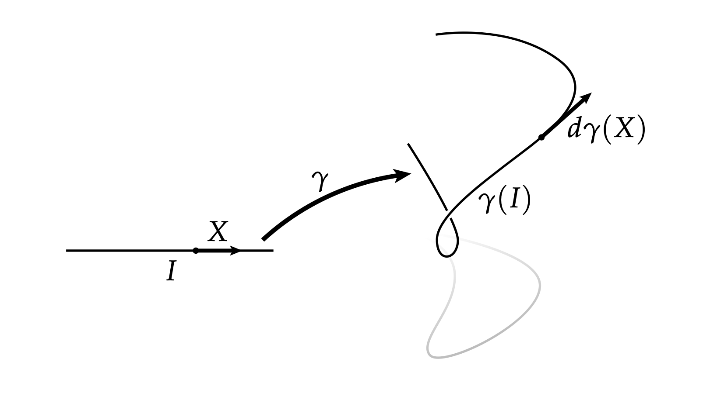

# 曲率

如图所示，映射$\gamma: I \rightarrow \mathbb{R}^3$给出了一条曲线，他是一个映射，将区间$I = [0, T] \in \mathbb{R}$映射到了$\mathbb{R}^3$中的一条曲线。它的切映射$d\gamma$给出了 切向量是如何通过$\gamma$进行拉伸的。通过$d\gamma$对前的切向量$d\gamma(\mathbf{X})$的长度记为：

$$ |d\gamma(\mathbf{X})| = \sqrt{d\gamma(\mathbf{X})\cdot d\gamma(\mathbf{X})}$$

如果$\gamma$是保长度的，那么对于切向量$\mathbf{X}$，它的诱导向量的曲线长度为：

$$ |d\gamma(\mathbf{X})|  = |\mathbf{X}| $$

这种参数化有多种名称（“单位速度”、“单位弧长”、“等距”），但其想法很简单，就是当我们从$\mathbb{R}$变为$\mathbb{R}^3时$曲线不会被拉伸——将$\gamma$视为完全松弛的橡皮筋。单位速度的方法通常比较适合用于离散情形，在这种情形中，一般没有说明定义域$\mathbf{I}$。

