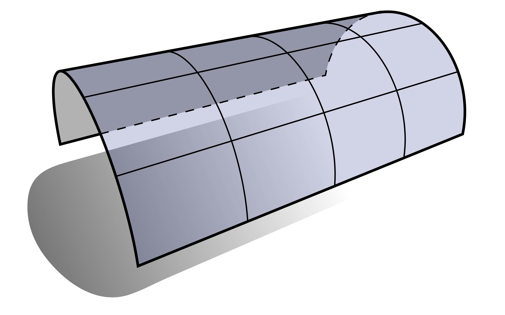
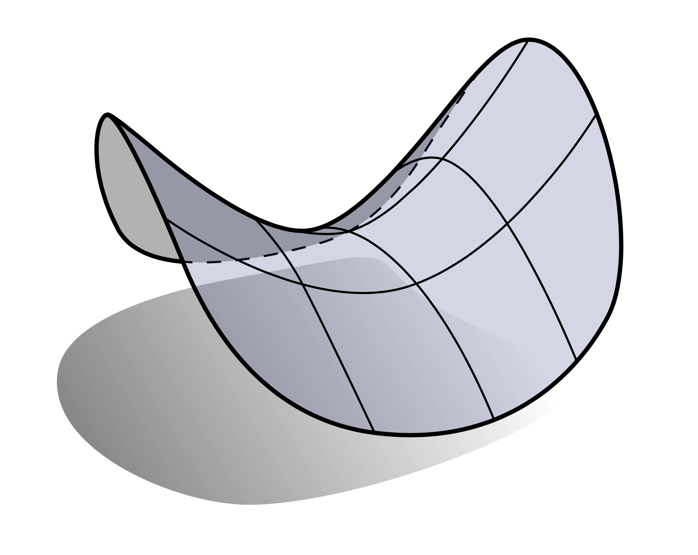
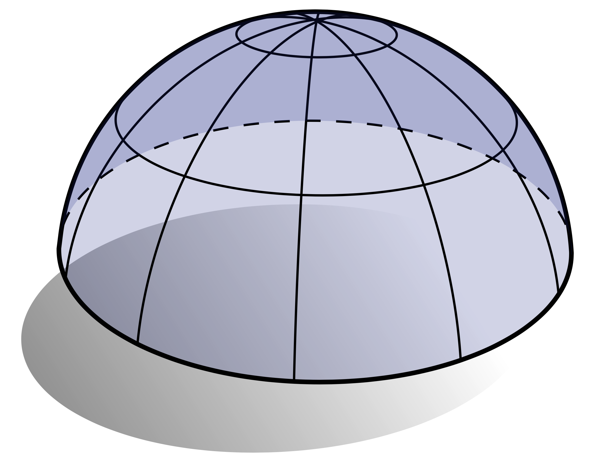

# 主曲率、平均曲率、高斯曲率

对于任何给定点，由于不同方向我们可以定义不同的曲率，那么，我们自然会问：曲面沿哪些方向弯曲最多？我们称最大和最小法向曲率$\kappa_1$ 和$\kappa_2$ 的单位向量 $\mathbf{X}_1$ 和$\mathbf{X}_2$ 为主方向，这两个最大最小的曲率称为主曲率。比如对于啤酒瓶这样的情况，在标记的点处，主曲率$\kappa_1 = 1, \kappa_2 = 0$。

我们也可以用形状算子来讨论主曲率，它是映射$S: TM → TM $满足: 对于任意切向量$X$有

$$ df(SX) = dN(X) $$

这个形状算子$S$和Weingarten映射$dN$本质上表达了同样的想法：他们都告诉我们当我们沿着方向$X$改变时候，法向量是如何变化的。唯一的区别是，$S$用$M$上的切向量来表示这种变化，而$dN$用$\mathbb{R}^3$中的向量来表示这种变化。值得注意的是，许多作者没有进行这种区分，只是假设$M$上的切向量和$\mathbb{R}^3$中相应切向量是等距的。但在本书中，我们需要更加小心，这样我们才能明确地解释各种量对$f$的依赖性，如果我们想要计算一些东西，这种依赖性十分重要。(顺便说一句，为什么我们总是可以用切向量来表示$N$的变化？这是因为$N$是单位法线，所以它不能在法线方向上增长或收缩。)

关于主方向和主曲率的一个特征是，它们分别对应于形状算子的特征向量和特征值：

$$SX_i = k_iX_i$$

更重要的是，这个主方向，在诱导度量的意义下正交：$g(X_1, X_2) = df(X_1)\cdot df(X_2)$。所以主曲率包含了一点处的法曲率的所有信息。对于任意切向量$Y$，我们可以用主方向$X_1$,$X_2$线性表示，假如$Y$是一个单位向量，它和$X_1$的夹角为$\theta$，那么和$Y$方向相关的法曲率可以表示为：

$$ k_n(Y) = k_1\cos^2\theta + k_2\sin^2\theta$$

但通常计算主曲率和主方向是比较困难的，特别是在离散的情形下，因此其实实际上我们一般不会使用它。

相比于主曲率，有两个相关的曲率叫做平均曲率和高斯曲率。平均曲率等于主曲率的算术平均数：

$$ H = \frac{k_1 + k_2}{2} $$

高斯曲率等于主曲率的乘积：

$$ K = k_1k_2 $$

$H$和$K$的值对表面的形状意味着什么呢？也许简单的想法就是高斯曲率就像一个逻辑“与”（两个方向都有曲率吗？）而平均曲率更像是一个逻辑“或”（是否至少有一个方向的曲率？）当然，这里你必须小心一点，因为当$k_1 = -k_2$。

零曲率曲面在数学中得到了很好的研究，因此它们有特殊的名称。高斯曲率为零的曲面称为可展曲面，因为它们可以“展平”或展平到平面中，而不需要任何拉伸或撕裂。例如，圆柱体的任何部分都是可展的，因为其中一个主曲率为零，如下图所示：

平均曲率为零的曲面称为极小曲面，因为（我们将在后面看到）它们最小化了表面积（相对于某些约束）。极小曲面往往是马鞍形的，因为主曲率的大小相等，但符号相反：

鞍形曲面也是负高斯曲率曲面的一个很好的例子。具有正高斯曲率的曲面看起来像什么呢？半球就是一个比较好的示例：

请注意，在这种情况下$k_1 = k2$，因此主方向不是唯一定义的，沿着任何方向X都可以获得最大（和最小）曲率。曲面上的任何这样的点称为脐点（umbilic point）。

关于曲率有很多有趣的定理和关系，它们都基于这个基本机制：曲面的曲率完全由主曲率表征，即最大和最小法曲率。高斯曲率和平均曲率只是两个主曲率的平均值，但（我们将看到）在实际应用中很容易计算。

