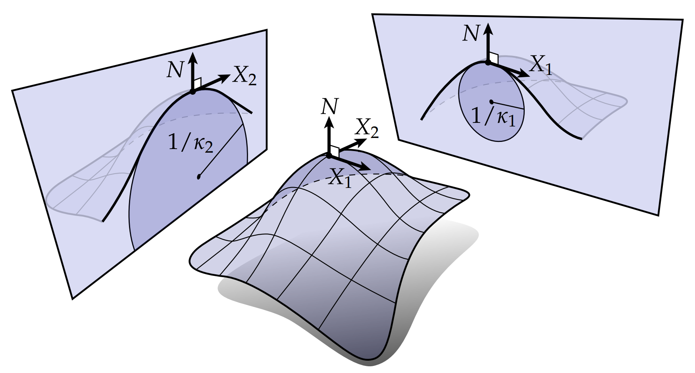

# 主曲率、平均曲率、高斯曲率

对于任何给定点，由于不同方向我们可以定义不同的曲率，那么，我们自然会问：曲面沿哪些方向弯曲最多？我们称最大和最小法向曲率$\kappa_1$ 和$\kappa_2$ 的单位向量 $\mathbf{X}_1$ 和$\mathbf{X}_2$ 为主方向，这两个最大最小的曲率称为主曲率。比如对于啤酒瓶这样的情况，在标记的点处，主曲率$\kappa_1 = 1, \kappa_2 = 0$。

我们也可以用形状算子来讨论主曲率，它是映射$S: TM → TM $满足: 对于任意切向量$X$有

$$ df(SN) = dN(X) $$

