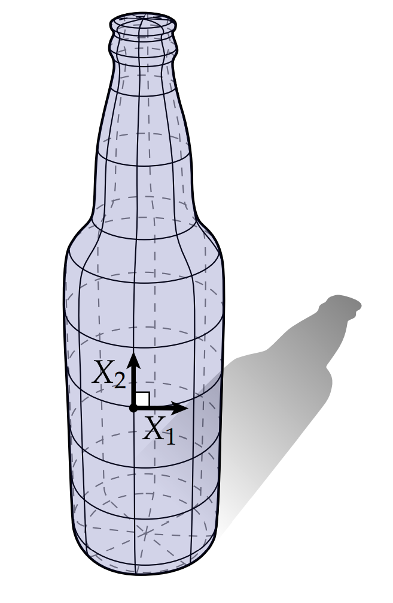
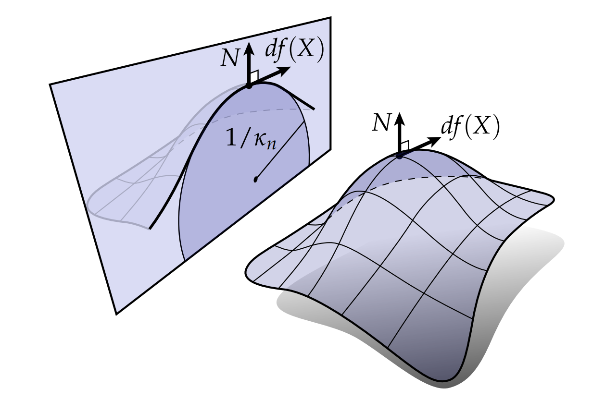

# 曲面的曲率

让我们更深入研究一下曲面的曲率。曲率这个词无比贴合我们日常对弯曲的理解：蛋壳、甜甜圈、瓶塞钻、意大利面都有各种各样的曲率；地板、天花板和直板盒却没有。那酒瓶之类的东西有没有呢？这种东西沿着一个方向是一个圈，另一个方向却是一条直线：

这种看待曲率的方式——根据曲面中包含的曲线——通常是我们处理曲率的一般方式。特别地，令$df(X)$为曲面上某个显着点的单位切线方向，考虑一个包含 $df(X)$和相应法线$N$的平面。这个平面和曲线相交，可以得到一条曲线。这条曲线在这个点的曲率$\kappa_n$称为在$X$方向的法曲率。

根据Frenet-Serret公式，曲率沿着曲线的变化量等于表示为$dN = \kappa T - \tau B$。因此，我们得到了沿着X方向的法曲率：

$$ \kappa_n = \frac{df(X) \cdot dN(X)}{|df(X)|^2} $$

分母$|df(X)|^2$归一化了当我们从域$M$进入$\mathbb{R}^3$ 时发生的任何“伸展”。注意到法曲率是有符号的，意味着曲面能向着或者远离法向弯曲。