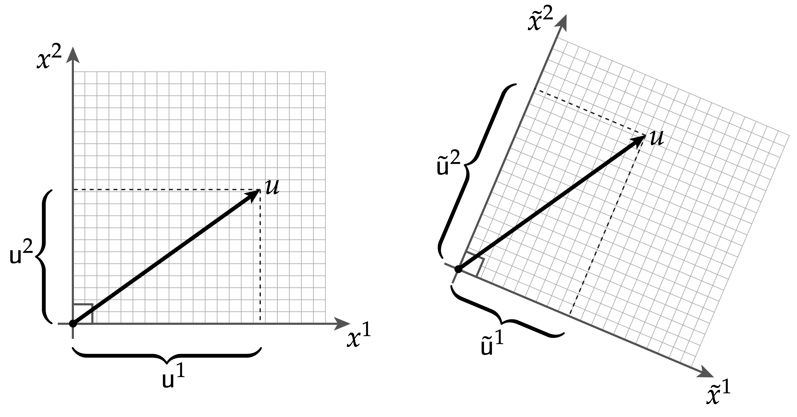

# 坐标化带来的麻烦

到目前为止，你已经看到了坐标化的一个缺点：表达式变得更长、更复杂。但是，也有其他很好的方式可以避免显式矩阵表示。因为矩阵可以用来表示许多不同类型的对象，这些对象可以以非常不同的方式表现。例如，你能猜出下面的矩阵代表什么吗？

$$\left[\begin{matrix} 0 & 1\\ 1 & 0 \end{matrix}\right] $$

不知道吧，因为这个矩阵可以表达太多意思，比如它是两个顶点上完整图的邻接矩阵、泡利矩阵$\sigma_x$、代表沿x轴的自旋角动量、甚至二面体群$D_4$元素。那么，你自然会想到，为什么一定要写成矩阵呢，它很容易让人忘记它的几何本质，也很容易让人忘记它应该满足那些条件。这里真正的哲学观点是，矩阵不是对象：它们只是对象的表示！或者套用柏拉图的话：matrices are merely shadows on the wall of the cave, which give us nothing more than a murky impression of the real objects we wish to illuminate(矩阵只是洞穴墙壁上的阴影，它给我们的不过是我们想要照亮的真实物体的模糊印象).

几何中经常出现的一个更具体的例子是线性算子和双线性形式之间的区别。所谓线性算子，它是一个线性空间到另一个线性空间的线性映射，例如：

$$f: \mathbb{R}^2 \rightarrow \mathbb{R}^2; u \mapsto f(u)$$

而双线性映射是讲两个向量映射成一个数：

$$g: \mathbb{R}^2 \times \mathbb{R}^2 \to \mathbb{R} ; (u,v) \mapsto g(u,v)$$

根据这两个例子，我们假设我们在一个坐标系$(x^1，x^2)$中，其中$f$和$g$由矩阵$A,B \in \mathbb{R}^{2\times 2}$   表示，其他参数用向量$u,v\in\mathbb{R}^2$表示，换句话说：

$$ f(u) = Au , g(u,v) = u^TBv$$

现在我们假设有一个新的坐标系$(\tilde{x}^1, \tilde{x}^2)$，它们之间的坐标转换矩阵为$P\in \mathbb{R}^{2\times 2}$，换句话说：

$$ \tilde{u} = Pu $$

$$ \tilde{v} = Pv $$

那么，在新的坐标系下，$f,g$该如何表示呢？我们实际上不能直接计算$A\tilde{u}$，因为$A$和$\tilde{u}$在不同的坐标系下。我们需要这样去计算它：

$$f(u) = PAu = PAP^{-1}\tilde{u} $$

同样的，对于双线性变换：

$$ g(u, v) = u^TBv = (P^{-1}\tilde{u})^TB(P^{-1}\tilde{v}) = \tilde{u}^T(P^{-T}BP^{-1})\tilde{v} $$

换句话说，$A \mapsto PAP^{-1}, B\mapsto P^{-T}BP^{-1}$

所以，我们如果做矩阵变换的时候，不是所有的对象都做相同的变换，当我们不断的给出新的坐标系，我们很容易忘记哪些变换应该应用于哪些对象。