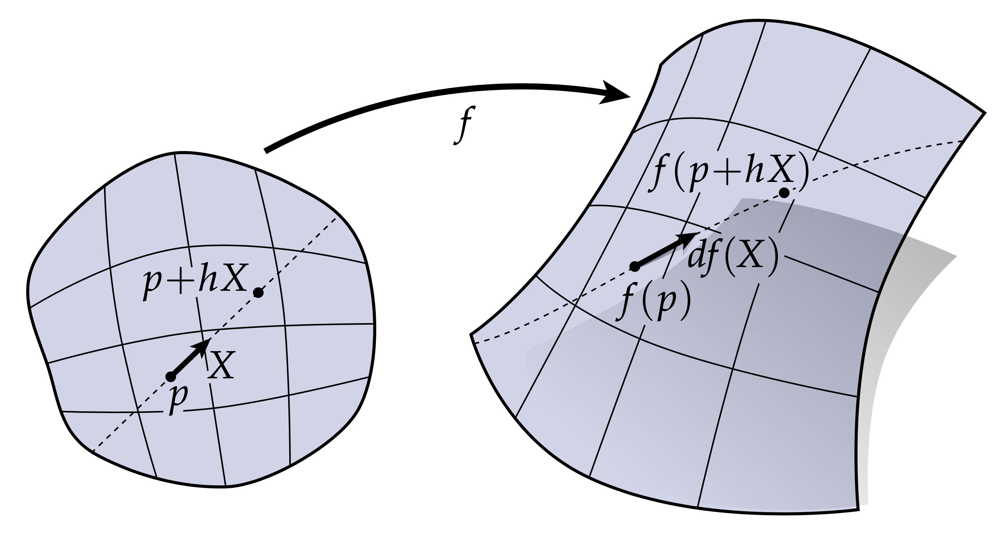

# 坐标化

到目前为止，我们已经对我们所研究的几何对象给出了相当抽象的描述。例如，我们对嵌入$f:M\rightarrow \mathbb{R}^3$的微分$df$告诉我们，我们的切向量丛域$M\subset \mathbb{R}^2$映射到$f(M)\subset\mathbb{R}^3$时，是如何被拉伸的，参考上图。从数学上，我们可以精确地定义$df（X）$，它是一个极限：

$$ df_p(X)=\lim\limits_{h \rightarrow 0}\frac{f(p + hX) - f(p)}{h} $$

但这公式仍然有一些抽象——在实际应用中，我们一般会需要一些更为具体的能用于编程的表达式。当我们开始处理离散曲面时，我们会发现$df(X)$通常有一个难以置信的具体几何意义，例如，它可能对应于网格中的一条边。但在光滑情形下，$df$的经典表达式是雅可比矩阵：

$$ J = \left[\begin{array}{cc} \partial f_1/\partial x^1 &  \partial f_1/\partial x^2 \\ \partial f_2/\partial x^1 &  \partial f_2/\partial x^2 \\ \partial f_3/\partial x^1 &  \partial f_3/\partial x^2 \end{array}\right]$$

这里我们的定义域为$\mathbb{R}^2$，值域为$\mathbb{R}^3$，$f$定义为：$f(x^1, x^2) = (f_1(x^1, x^2), f_2(x^1, x^2), f_3(x^1, x^2))$

其中$f_1, f_2, f_3$是三个标量函数，如果你想计算$df$，你需要将$J$作用到$X = [X^1, X^2]^T$上。