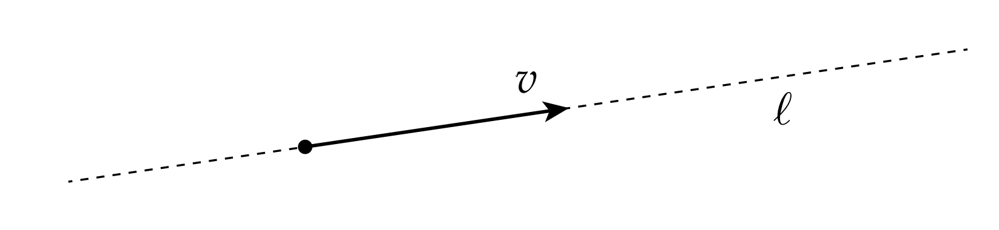

# 热身运动：1向量与2向量

我们如何在$\mathbb{R}^n$中描述一个体元？外代数的基本想法是：粗略地讲，k维体元能被k个向量描述。在线性代数中，我们有类似的想法：k个向量通过span，能张成k维线性子空间(1个向量张成一条直线，2个向量张成一个平面，以此类推)。在这两种情况下，选择哪些特定的向量都不重要(只要它们线性无关即可)：例如，正如许多不同的向量对可以张成同一平面一样，许多不同的向量都可以用来描述同一个2向量。总的来说，出现在外代数中的k向量与线性子空间没有太大区别，除了

1. 它们具有有限的范围，即外代数有大小
2. 它们具有固定的方向

这里的方向是什么意思呢？一个比较好的类比例子是直线$l$和向量$v$：

