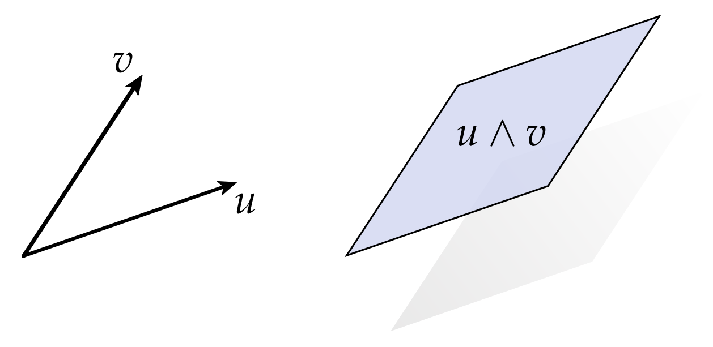
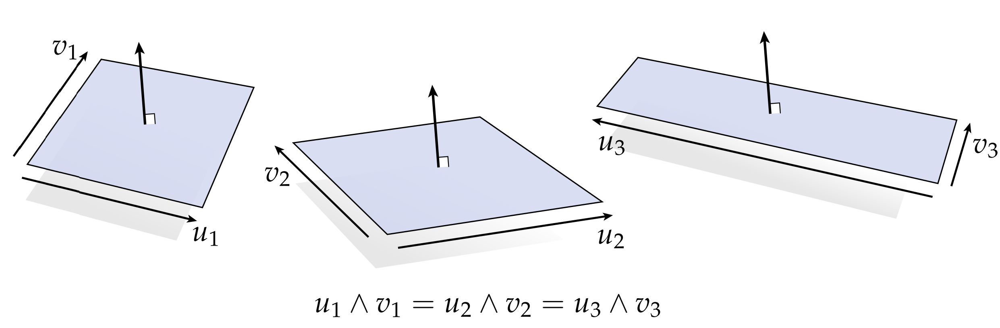
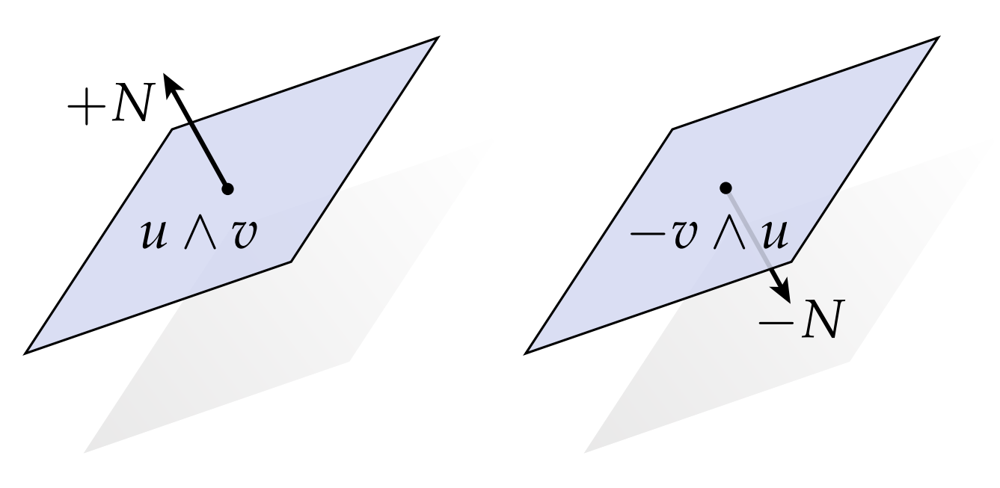
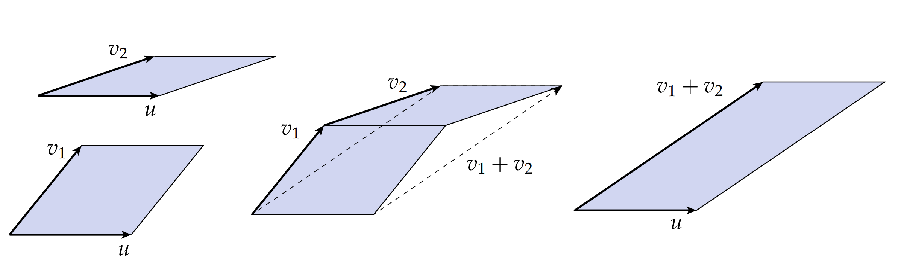
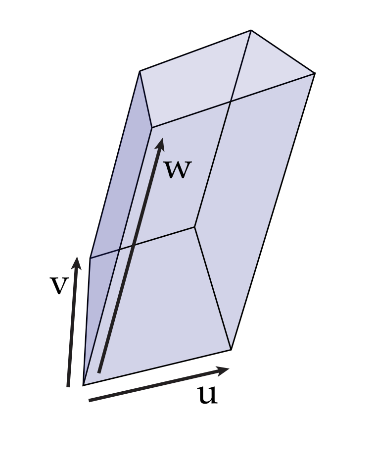
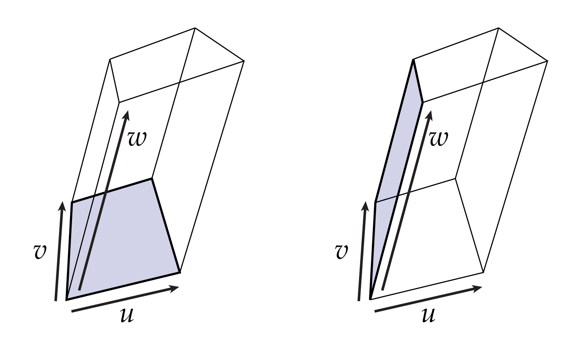

# 热身运动：1向量与2向量

我们如何在$\mathbb{R}^n$中描述一个体元？外代数的基本想法是：粗略地讲，k维体元能被k个向量描述。在线性代数中，我们有类似的想法：k个向量通过span，能张成k维线性子空间(1个向量张成一条直线，2个向量张成一个平面，以此类推)。在这两种情况下，选择哪些特定的向量都不重要(只要它们线性无关即可)：例如，正如许多不同的向量对可以张成同一平面一样，许多不同的向量都可以用来描述同一个2向量。总的来说，出现在外代数中的k向量与线性子空间没有太大区别，除了

1. 它们具有有限的范围，即外代数有大小
2. 它们具有固定的方向

这里的方向是什么意思呢？一个比较好的类比例子是直线$l$和向量$v$：

一条直线虽然给出了一个方向，但是没有说那边是正向。相比之下，一个向量编码了一个方向，且定义了正向(例如：$+v$和$-v$表示了相反的两个方向)。除此之外，向量还有个大小，通过他的长度给出。这个源于直线和向量的区别的基本思想给了我们定义k向量的基础：一个k向量之于k维线性空间，正如向量之于直线。事实上，向量就给了我们一个最初的外代数的例子：1向量就是向量。

2向量怎么说呢？一个比较好的对2向量可视化的方式需要和2个向量$u,v \in \mathbb{R}^3$相关，这两个向量构成了一个平行四边形，如图所示：

简单地，可以这样记忆，我们用一个微小的平行四边形表示2向量，记作$u \wedge v$（这里$\wedge$符号读作"wedge"）。正如普通向量一样，2向量也需要考虑大小和方向。例如，下图中的所有平行四边形都经过精心构造，具有相同的面积。因此，这三个矢量都描绘了相同的2矢量，尽管它们的倾斜和拉伸程度不同：

从这个意义上说，我们给出的平行四边形只是一个2矢量的“一些示例”，因为它们每个只描绘了许多可能性中的一种。但我们能用他们来说明2向量代表的意义。

那么，最重要的来了，我们如何定义2向量的方向呢？和普通向量一样，它源于一个最简单的想法：两个1向量$+u$和$-u$有不同的方向，因为它们虽然共线，但是指向的方向却相反。类似地，在$\mathbb{R}^3$中2向量的两个方向可以看成“向上”和“向下”，对应于它们所在平面单位法向给出的那个方向$+N$和$-N$。因此，我们区分两个表达式：$u\wedge v$和$v \wedge u$，它们的关系是$u\wedge v = - v\wedge u$，它们给出了两个相反的方向：

除此之外，我们还需要说明一个事情，那就是：

$$ u\wedge u = 0 $$

这就是说，两个完全平行的向量无法围成平行四边形，这个性质也可以通过关系式$u\wedge v = - v\wedge u$得出，当$v = u$时，我们得到$u\wedge u = -u\wedge u$。

另一个值得注意的事是一个实数$a \in \mathbb{R}$作用于2向量中任意一个向量，等价于把这个2向量加倍，如图所示：

用数学语言表达为：

$$ (au) \wedge v = a(u\wedge v) $$

当然，你把$a$作用到$v$上也有相同的效果，即：$u\wedge(av) = a(u\wedge v)$。

现在我们来考虑一下如果我们把其中1个向量加一下，会有什么结果呢？如下图所示：

上图最左边表示的是$u\wedge v_1 + u\wedge v_2$，最右边表示的是$u\wedge(v_1 + v_2)$，中间的这个图表示左右两边是相等的，因额外i我们失去的面积和得到的面积实际上是一样多的(因为你必须投影到虚线所在的平面上，使得这个加法的结果还是一个平面)。换句话说：

$$ u\wedge v_1 + u\wedge v_2 = u\wedge(v_1 + v_2) $$

最后，我们来思考一下体元的情况，我们将一个体元看作微小的平行六面体：

正如2向量，我们用3个向量wedge表示体元(3向量)：$u\wedge v\wedge w$。此外，我们可以认为这个3向量是首先通过2个向量构造出一个平行四边形，然后再朝着第三个方向拉伸这个平行四边形得来的：

注意到，你先把哪两个向量张成平行四边形，然后再拉升这个顺序并不重要：我们可以先构建2向量$u\wedge v$，然后再朝着$w$拉伸，也可以先构建$v\wedge w$，然后再朝着$u$拉升。用数学的语言来表述，可以用以下公式：

$$  (u\wedge v)\wedge w = u\wedge(v\wedge w) $$

我们把它简单写成$u\wedge v\wedge w$，注意到这样并不会造成任何歧义。如果我们变换两个向量的顺序来构建最开始的平行四边形呢？之前我们讲过$u\wedge v = -v\wedge u$，也就是说交换2向量的顺序等价于交换它们的方向，因此我们会得到$(u\wedge v) \wedge w = -(v \wedge u)\wedge w$ ，或者直接写成：

$$ u\wedge v \wedge w = -v\wedge u \wedge w $$

从几何上怎么解释这个事情呢？减号似乎表明这两个体元在方向上是不同的。但是体元的方向意味着什么呢？对于向量来说，两个方向$+u$和$-u$代表是朝前还是朝后；2向量$u\wedge v$和$v\wedge u$代表平面是朝上还是朝下。对于3向量，我们可以想象体元有内外两个方向，比如你可能会想象沿着边界的法线方向，点可以进进出出，或者边界的一侧被涂成红色，而另一侧被涂成蓝色。这两种情形定义了两个方向。你可以观察到，每次我们将3向量中任意两个向量交换顺序后，3向量的方向都会切换；如果我们再次切换另外两个向量的顺序，这个方向又会变回来。因此，对向量作用奇排列保定向，作用偶排列逆转定向，换句话说：

$$ u\wedge v \wedge w = v \wedge w \wedge u = w\wedge u \wedge v $$

$$ w\wedge v \wedge u = v \wedge u \wedge w = u\wedge w \wedge v $$

以上两个组等式表明它们的方向相同，但是这两组等式所代表的3向量方向相反。
