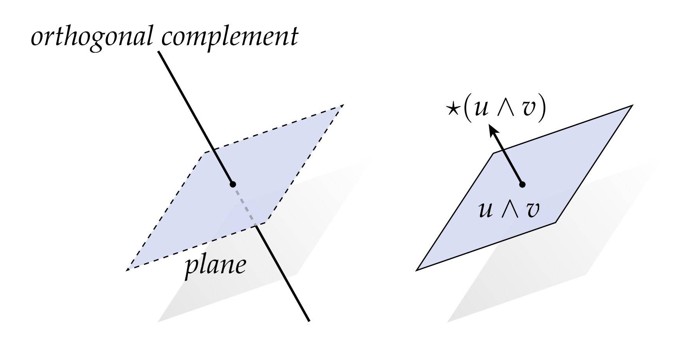
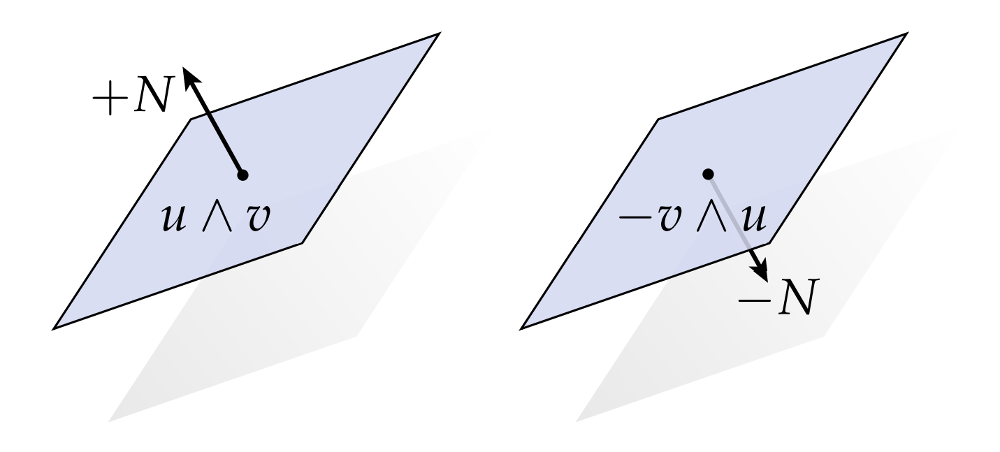
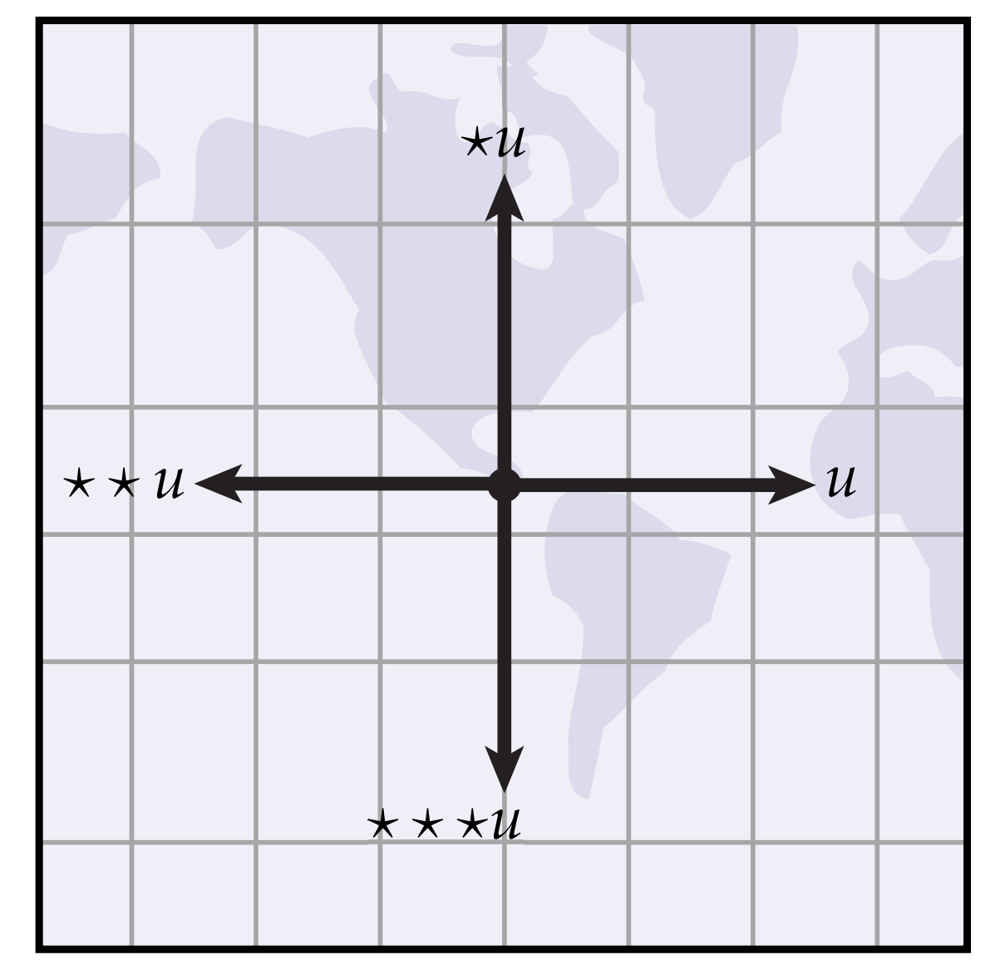

# 霍奇星算子

通常，通过指定集合的补集来指定集合更为方便。比如有一天我问你“你喜欢吃啥？”。然后你回答：”除了XXX，我都喜欢吃。“实际上你就通过补集的方式来定义了你喜欢吃的东西的集合，否则你会回答：”我喜欢吃披萨、苹果、汉堡，……“，这样啰啰嗦嗦讲一堆。在线性代数中，这种思路一个比较好的例子是所谓”正交补“的概念：对于一个k维线性空间$V$的n维子空间$W \subset V$，我们能取出到n个线性无关的向量$w_1, w_2, \cdots, w_n$，它们张成了$W$，同时我们可以在$V$取出k-n个线性无关的向量，这些向量和$W$中的任意向量都正交，它们张成一个n-k维的线性空间，这个空间称为$W$的正交补。比如$\mathbb{R}^3$中的两个不共线的向量可以张成一个平面，这个平面有且仅有一个向量和它垂直：

在外代数中，我们用霍奇星$ * $来为k向量提供正交补的概念。一般地，如果我们有一个k向量$v\in \mathbb{R}^n$，那么$*v$则表示一个一个(n-k)向量，在某种意义上，表示了原来k向量的正交补。这个正交补是怎么理解呢？我们也从$\mathbb{R}^3$中的2向量开始：

$\mathbb{R}^3$中的平面能够被它的单位法向量唯一确定（这个法向量张成了平面的正交补），一个2向量$u\wedge v$能够被在他法向量方向的向量唯一确定。但是，它法向量方向的向量这么多，我们选哪一个呢？不像线性子空间，我们不需要为正交补定义大小，我们需要给2向量的”正交补“$*(u\wedge v)$定义一个大小。这里没有“最佳”选择，我们只需要采用一个惯例并坚持下去——一个很好的方式是使用定义叉乘$u \cross v$时用的右手法则。对于任意一个2向量$u \wedge v$，我们要求：

$$ \det(u, v, *(u \wedge v)) > 0 $$

也就是说，组成$u\wedge v$的两个向量和通过霍奇星算子得到的向量，它们组成的矩阵的行列式需要是正数。事实上，这条规则与通常的右手规则相对应，意思是$*(u \wedge v)$指向的方向与$u \cross v$的方向相同。大小怎么说呢？我们同样通过行列式指定大小——特别的，对于两个相互正交的向量$u_1, u_2$，我们要求：

$$ \det(u_1, u_2, *(u_1 \wedge u_2)) = 1$$

由于$\mathbb{R}^2$中的向量总是可以用正交基表示，所以这个规则唯一地确定了任何2向量的霍奇星，通过这个方式，我们能得到$*(u\wedge v) = u\cross v$，也就是说，对于任意$\mathbb{R}^3$中的两个向量，我们先把它们wedge成2向量然后再取霍奇星，等价于直接把它们做叉乘。

一般地，假设$e_1, e_2, \cdots, e_n$是$\mathbb{R}^n$中的正交基，如果我们挑出k个正交的向量$u_1, u_2, \cdots, u_k$，霍奇星可以用下面的规则唯一定义：

$$ (u_1 \wedge u_2 \wedge \cdots \wedge u_k) \wedge *(u_1 \wedge u_2 \wedge \cdots \wedge u_k) = e_1 \wedge e_2 \cdots \wedge e_n $$

简而言之，如果我们一个k维的单位块和它的(n-k)维的”正交补“块wedge到一起，最终我们可以得到$\mathbb{R}^n$中的单位块。

一个重要的特例（特别是考虑曲面时）是$\mathbb{R}^2$中1向量的霍奇星，也就是说对平面上的单位向量进行霍奇星操作。它很容易用一幅图显示：如果我们有1个1向量$u$，然后对它进行霍奇星，得到$*u$，这个向量应该是一个(n-k)向量，但是由于2-1=1，因此我们还是得到了1向量，而且这个1向量和$u$正交。如图所示，如果$u$指向东边，那么$*u$指向北边：

如果我们持续作用霍奇星，那么这个向量会依次指向西边，南边，然后再只会东边。换句话说，2D的霍奇星算子，就是把一个向量不断逆时针旋转90度改变方向。

最后，我们可以考虑霍奇星和wedge之间的运算关系。例如，对于$\mathbb{R}^3$中的两个1向量u，v，我们有

$$ *(u + v) = *u + *v $$

因为先把两个向量加一起然后转90度，和先转90度再把他们加一起没啥区别。更一般地说，这个恒等式适用于任何维度的任意两个k向量，即，霍奇星具有分配律（你能画出其他图片让这个想法更清晰吗？）。

