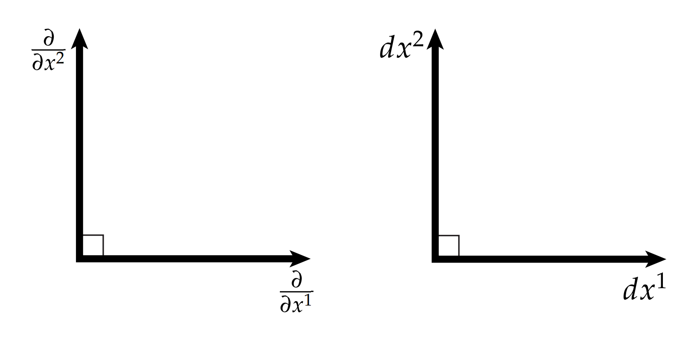

# 坐标系

到目前为止，我们都尽量避免了使用坐标系——换句话说，我们尝试着不在一个特别的坐标系统$x_1, \dots, x_n$中描述几何。为什么要尽量避免坐标系呢？各种文献中有几个常见的原因经常被提到（人们总是讲“不变性“），但实际上真正的原因很简单，坐标系无关的表达往往更简介、更优雅，更容易从中提取几何意义。这种方法在几何处理中尤为常见，因为很多坐标系无关的表示可以很自然地转化为网格上的一个基本操作符。

然而，坐标在许多情况下仍然很有价值。有时，有一个特殊的坐标基础，可以极大地简化分析——比如我们对主曲率方向的讨论。在其他时候，如果不基于坐标系，根本没有明显的方法给出一些东西的证明。现在我们必须给出一些外微分在坐标系中的基本表现。但在最后，我们仍然需要保留坐标系无关的表达方式，有礼貌地忽略坐标系已经存在的事实。

现在让我们来构建坐标系统吧。简单起见，我们使用符号$\frac{\partial}{\partial x^1},\cdots , \frac{\partial}{\partial x^n}$表示表示$\mathbb{R}^n$中向量的基，用$dx^1, \cdots, dx^n$表示余切向量的基。换句话说，向量$v$可以写成线性组合：

$$ v = v^1 \frac{\partial}{\partial x^1} + \cdots + v^n \frac{\partial}{\partial x^n} $$

余切向量$\alpha$可以写成：

$$ \alpha = \alpha_1 dx^1 + \cdots \alpha_n dx^n$$

这些个$\frac{\partial}{\partial x^i}$和$dx^i$看起来很像是偏导数符号，但在这里它们只是单位长度正交基的集合，如上图所述。

两个基$\frac{\partial}{\partial x^i}$和$dx^i$通常表示对偶基，即：

$$ dx^i(\frac{\partial}{\partial x^j}) = \delta^i_j = \left\{ \begin{split} 1, & i =j \\ 0, & otherwise \end{split} \right. $$

这个关系准确地捕捉了我们需要描述的几何关系：当且仅当向量$\frac{\partial}{\partial x^i}$和余切向量$dx^j$同向时， $\frac{\partial}{\partial x^i}$能够在$dx^j$上投影得到阴影。使用这个关系，我们能算出：

$$ \alpha(v) = \sum\limits_i \alpha_i dx^i(\sum\limits_j v^j\frac{\partial}{\partial x^j}) = \sum\limits_i \alpha_iv^j$$

也就是说用余切向量作用向量，正好就像是欧几里得空间的内积。
