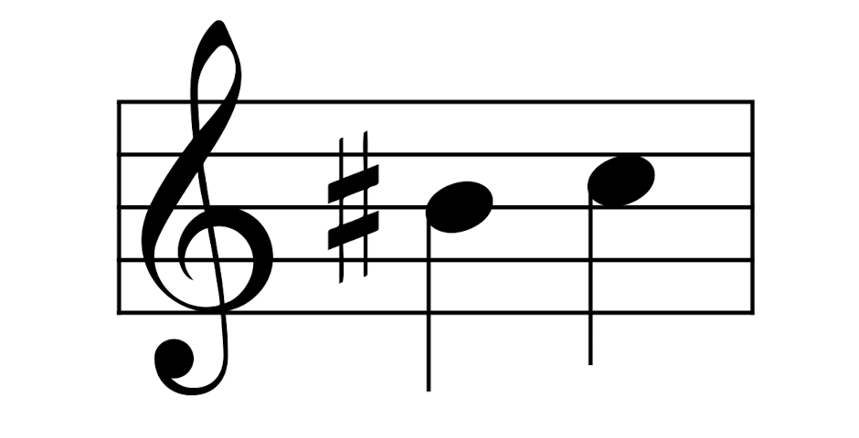
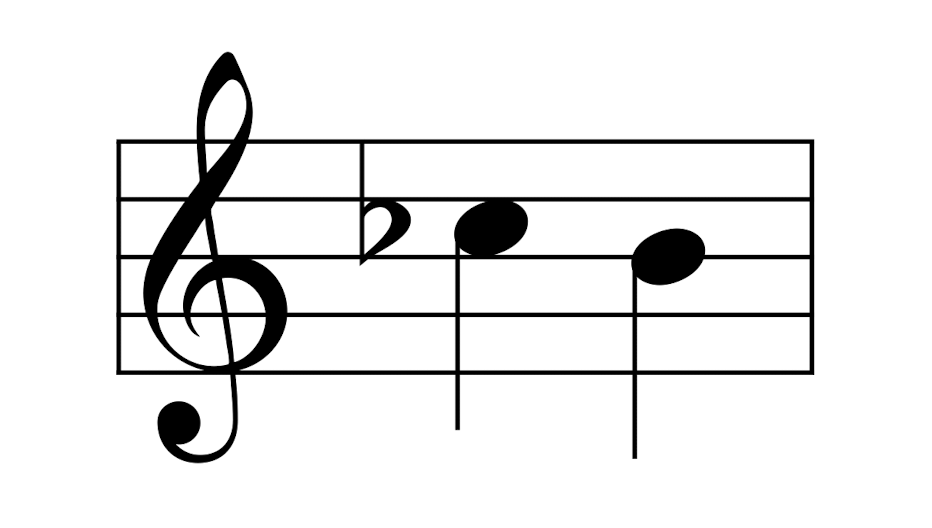

# 符号说明

我们现在需要花一些时间来说明一下符号。向量和向量场分别用罗马大小写的字母表示（比如：$u$、$v$、$w$和$X$、$Y$、$Z$），然而1形式由希腊字母表开头的小写字母组成（比如$\alpha$、$\beta$、$\gamma$），前者一般还是得区别一下是向量还是向量场，但后者一般不区别到底是余切向量还是余切向量场，都说成1形式(本书翻译1形式特指余切向量场)。标量场或者0形式一般用中间的那些罗马字母($f$、$g$、$h$)或者小写希腊字母($\phi$、$\psi$等)表示。

你可能注意到了，我们坐标化描述一个向量时，他的分量的系数$v^i$写的是上标，而余切向量系数$\alpha_i$用的是下标。类似的，向量的基$\frac{\partial}{\partial x^i}$，他的指标在下面(分母上)，余切向量的基在上面$dx^i$，这些符号其实是满足爱因斯坦求和约定的，即：任意一组指标相同的上下标写一起，代表穷尽他们的指标求和，用数学公式描述为

$$ \alpha_i v^i = \sum\limits_i \alpha_i v^i $$

符号的位置也为音乐同构提供了一个形象的记忆方法：#以及b。在乐谱中#表示音阶升半阶，对应于棍子向上移动。例如，下面的两个音符都对应于相同音阶的“C”：

因此，从余切向量转化成向量，我们升了指标。在一个平坦的空间中，我们不必担心度量，也不必担心，因此余切向量可以写成：

$$ \alpha = \alpha_1dx^1 + \cdots \alpha_n dx^n $$

当它转化为向量时：

$$ \alpha^\# = \alpha^1 \frac{\partial}{\partial x^1} + \cdots + \alpha^n \frac{\partial}{\partial x^n} $$

同样的，b实际上就是降了音阶。

因此b表示把一个余切向量转化为切向量，即将

$$ v = v^1 \frac{\partial}{\partial x^1} + \cdots + v^n \frac{\partial}{\partial x^n}  $$

转化为：

$$ v^b = v_1 dx^1 + \cdots + v_n dx^n  $$

