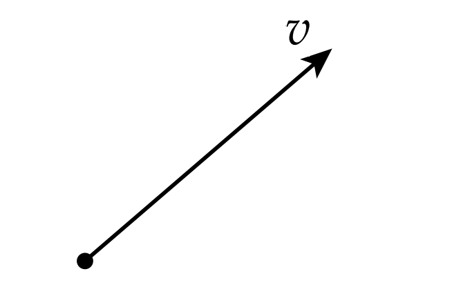
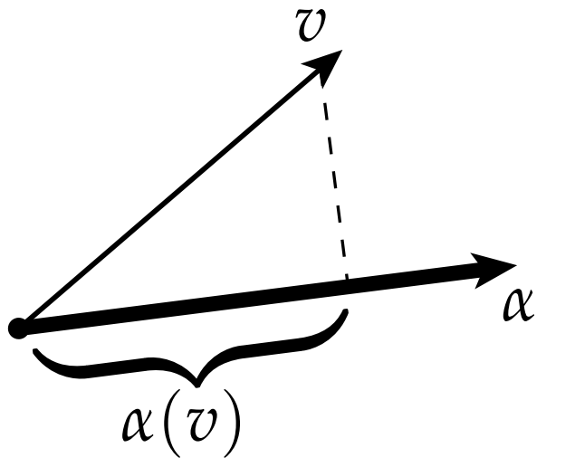

# 向量场和微分1形式

到目前为止，我们已经用微小体元的语言讲述了外代数，现在我们需要更进一步讨论外微分。

给出一个向量$v$:

这个$v$包含了哪些信息呢？它包含了大小和方向。如果我们随便搞一个别的方向的向量$\alpha$，并且记录$v$在$\alpha$方向的投影

它的结果是一个书，我们记为：$\alpha(v)$。这个记号意味着我们强调$\alpha$是一个函数。注意到，这是一个线性函数，它把一个向量映射成了一个数，任意一个这样的函数我们把它称为1形式(也称为余切向量)。[译者注：一般余切向量场也叫做1形式，为了不引起歧义，此后本书翻译one forms为两种：如果是余切向量场，就直接翻译成1形式，如果是余切向量，就只翻译成余切向量。

当然，从图中可以清楚地看到，所有余切向量构成的空间看起来很和所有向量构成的空间长得完全一样。但是我们仍然有一个很好的方式（行向量和列向量）来区别向量和余切向量：当然这个区别不仅仅只是把行向量变成列向量这么简单就是了。它们有类似的乘法操作，正如行向量和列向量可以直接乘起来：

$$ \left[ a_1 \cdots a_n \right] \left[\begin{array}{c} v^1 \\ \vdots \\ v^n \end{array} \right] $$

当然，如果我们想把两个列向量内积，我们需要把第一个给转置了才行：

$$ v^Tv  = \left[ v^1 \cdots v^n \right] \left[\begin{array}{c} v^1 \\ \vdots \\ v^n \end{array} \right] $$

我们处理向量和余切向量，我们希望有两个不同的操作符：sharp(#)，这个将余切向量转化为向量(类似于将行向量转为列向量)，和flat(b)这个将向量转化为余切向量。因此，我们可以优雅而有效地重写$v^b(v)$和$a(a^\#)$。这两个操作符#和b叫做音乐同构（musical isomorphism）

所有这些关于余切向量和向量（甚是row和column向量）的琐碎定义似乎都是无中生有。事实上，在平面这样的平直空间中，两者之间的区别就是几乎没区别。在弯曲空间中，区分向量和余切向量是无比重要的——特别是我们需要在正确的空间中谈论度量。比如，如果我们想测量一个向量$v$沿着另一个向量$u$方向的长度。我们需要注意的是，切向量被映射$f : \mathbb{R}^2 \supset M \to \mathbb{R}^3$拉伸了，因此#和b操作符需要满足以下关系：

$$ u^b(v) = g(u, v) $$

其中$g$是$f$的诱导度量。通过这种方式，我们实际上是在测量事物在“伸展”空间中的行为，而不测量初始域$M$的行为。

