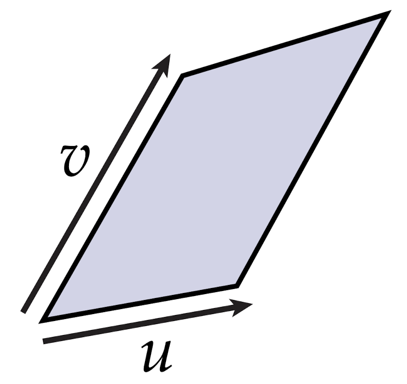
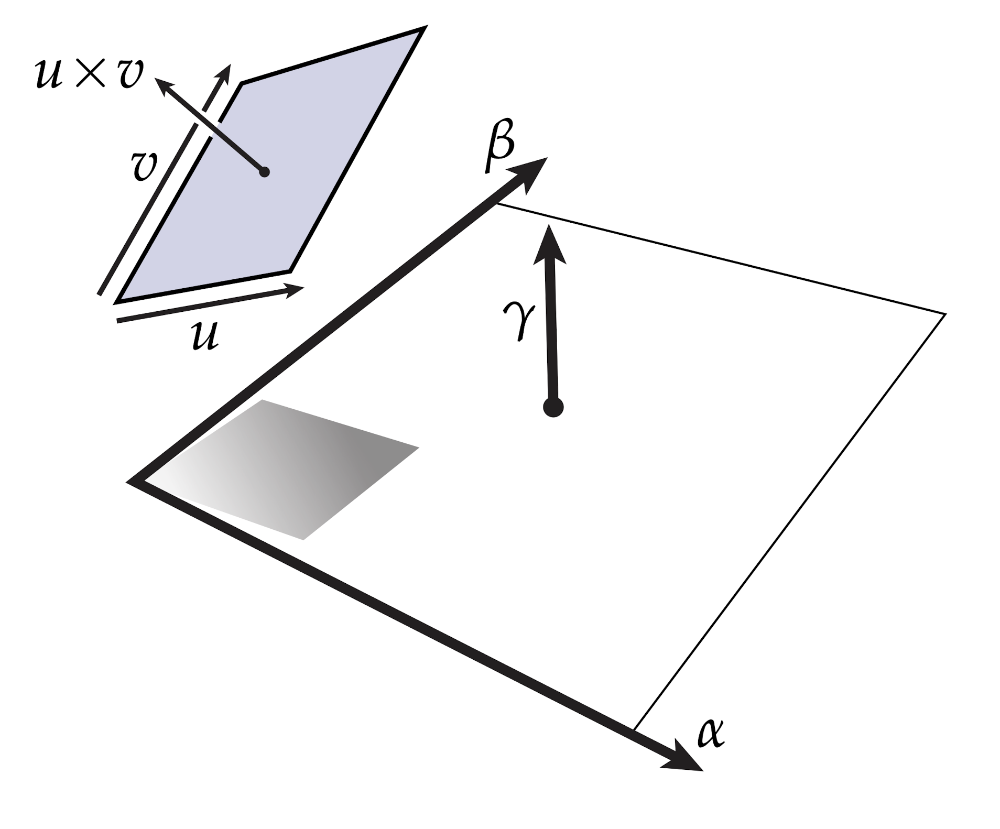
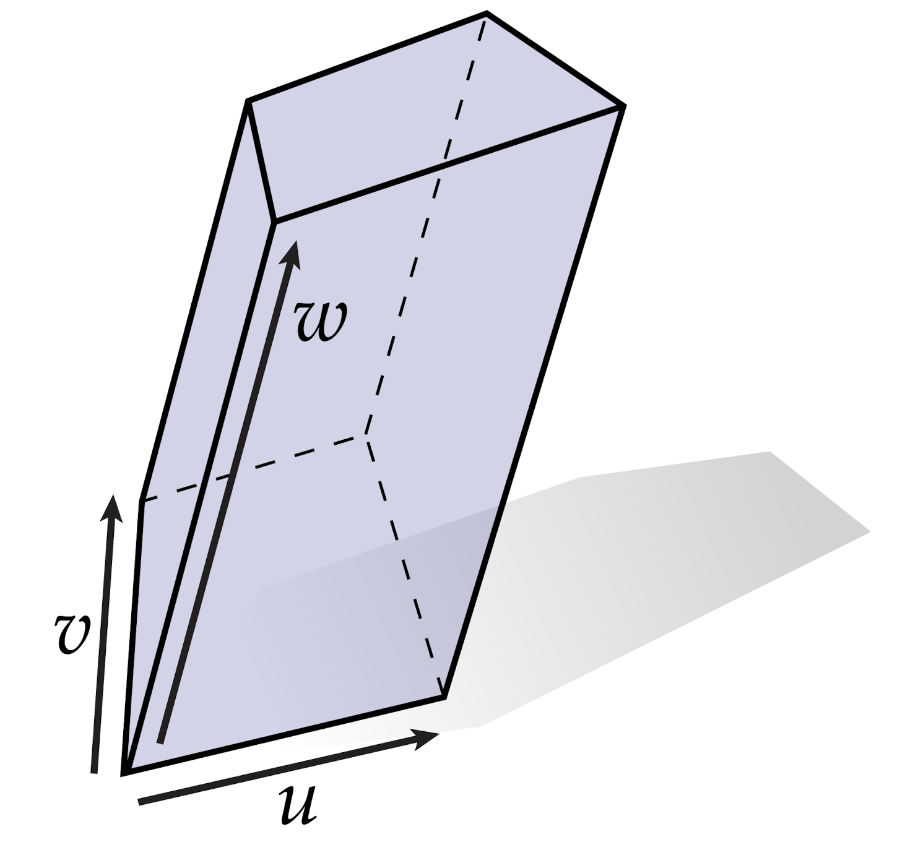
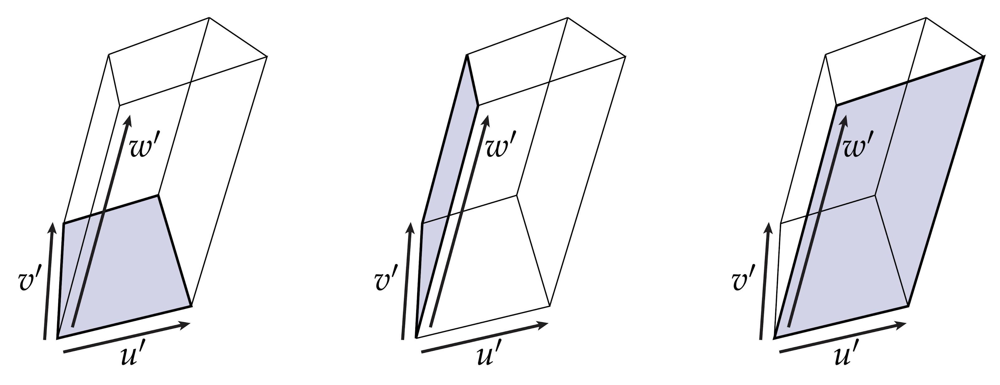

# 微分形式与wedge

前面章节我们讲诉了一个像素投影到微分坐标系当中的测量方法。这个测量过程有效地定义了我们所说的余切向量。但是如果我们有一组向量会发生什么呢？例如，考虑$\mathbb{R}^3$中的一对向量$u,v$：

我们考虑这两个向量定义了一个平行四边形，就像我们对单个向量所做的那样，我们可以通过测量平行四边形在某个平面上投射的“阴影”的大小来测量它：

例如，假设我们通过一对单位正交的余切向量$\alpha$和$\beta$来表示这个平面。然后投影向量有分量：

$$ \begin{split} &u' = (\alpha(u) , \beta(u))^T \\ &v' = (\alpha(v) , \beta(v))^T \end{split} $$

因此，(带符号的）投影面积由叉积给出：

$$ u' \times v' = \alpha(u)\beta(v) - \alpha(v)\beta(u) $$

由于我们希望在将来可能测量大量的投影体积，我们将此操作命名为"$\alpha \wedge \beta$":

$$ \alpha \wedge \beta(u, v) = \alpha(u)\beta(v) - \alpha(v)\beta(u)$$

正如你已经知道的$\alpha \wedge \beta$是一个2-余切向量。最终我们将解释这个符号$\wedge$（发音为“wedge”）作为微分形式上的二元运算，称为Wedge。Wedge的代数性质直接来自有符号体积的计算方式。请注意，如果我们颠倒轴$\alpha$，$\beta$的顺序，面积的符号就会改变。换句话说，Wedge是反对称的：

$$ \alpha \wedge \beta = -\beta \wedge \alpha $$

反对称性的一个重要结果是，任何余切向量对自身的Wedge为零：

$$ \alpha \wedge \alpha = -\alpha \wedge \alpha \to  \alpha \wedge \alpha  = 0$$

从几何角度来说，为什么两个一样的余切向量的Wedge应该为零呢？很简单，因为它表示投影到一个面积为零的平面上！(等价于平行四边形被$\alpha$和$\alpha$张成)。

接下来，考虑$\alpha$和$\beta$张成的以及$\alpha$和$\gamma$张成的两个不同平面上的投影，投影的结果为：

$$ \begin{split} \alpha \wedge \beta(u, v) + \alpha \wedge \gamma(u, v) &= \alpha(u)\beta(v) - \alpha(v)\beta(u) + \alpha(u)\gamma(v) - \alpha(v)\gamma(u) \\ &= \alpha(u)(\beta(v) + \gamma(v)) -   \alpha(v)(\beta(u) + \gamma(u)) \\ &= \alpha \wedge(\beta + \gamma)(u, v) \end{split} $$

换句话说，$\wedge$满足+运算符的分配律：

$$ \alpha \wedge(\beta + \gamma) = \alpha \wedge \beta + \alpha \wedge \gamma $$

最终，考虑三个向量$u,v,w$，张成了一个$\mathbb{R}^3$中的一个平行六面体：

我们考虑三个1-形式$\alpha$、$\beta$和$\gamma$张成的平行六面体的体积的投影，但是一个体积到另一个体积的投影有点难以想象！现在我们令$\alpha = dx^1, \beta = dx^2$和$\gamma = dx^3$，你可以内心想象这个微元平行六面体是如何投影的。有一种可以投影立方体的方式是使用行列式投影向量：

$$ \alpha \wedge \beta \wedge \gamma(u, v, w) := \det([u'\ v'\ w']) = \det\left( \left[ \begin{array}{ccc}\alpha(u) &\alpha(v) & \alpha(w) \\ \beta(u) & \beta(v) & \beta(w) \\ \gamma(u) & \gamma(v) & \gamma(w)  \end{array} \right] \right) $$

（你注意到左上角2x2子矩阵的行列式也给出了两个1-形式的wedge吗？)或者，我们可以将体积表示为其中一个面的面积乘以剩余边的长度：

我们可以用这个方式来考虑这件事：我们可以用三重积来定义Wedge：

$$ \begin{split} \alpha \wedge \beta \wedge \gamma (u, v, w) &= (u'\times v') \cdot w'  \\ &=  (v'\times w') \cdot u' \\ &= (w' \times u') \cdot v  \end{split}$$

总之，k个1-forms的wedge为我们提供了一个k-form，它测量k-向量集合的投影体积。对于任何k-形式$\alpha$，l-形式$\beta$和m-形式$\gamma$，wedge都具有以下特性：

$$ \begin{split} \mathtt{反对称性} &: \alpha \wedge \beta =(-1)^{kl}\beta \wedge \alpha \\ \mathtt{结合律} &: \alpha \wedge (\beta \wedge \gamma) = (\alpha \wedge \beta) \wedge \gamma \end{split} $$

当l=m时候，还有分配律：

$$ \alpha \wedge (\beta + \gamma) = \alpha \wedge \beta + \alpha \wedge \gamma $$

另一个值得注意的是，k-形式的参数是反对称的——换句话说，切换两个“输入”向量的相对顺序只会改变体积的符号。比如$\alpha$是一个2-形式，那么$\alpha(u,v) = -\alpha(v, u)$。一般来说，偶数次的交换次数将保留符号，奇数次的交换次数需要取负号。（说服自己的一个方法是，当你交换矩阵的两列时，考虑矩阵的行列式会发生什么。）最后，你会经常听到人们说k-forms是“多线性的”——这意味着，如果除了一个向量外，所有向量都保持不变，那么k-形式看起来就像一个线性映射。从几何学上讲，这是有意义的：k-形式是由k个长度的线性函数测量值（基本上就是k个不同的点积）建立起来的。

